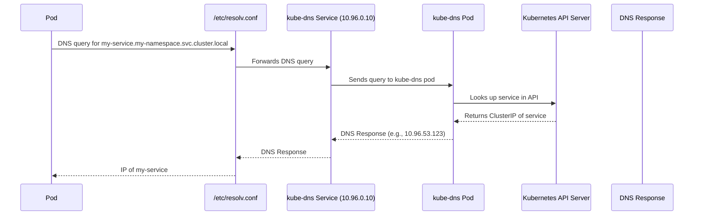

# Container Orchestration

## Cluster Networking

- **Node Configuration:**
    - Each **node** (master or worker) must have:
        - At least **one network interface** (e.g., `eth0`)
        - A **configured IP address**
        - A **unique hostname**
        - A **unique MAC address** (important when cloning VMs)

---

### 🌐 **Network & Ports Overview**

#### **Key Nodes:**

- `master-01`: `192.168.1.10`
- `worker-01`: `192.168.1.11`
- `worker-02`: `192.168.1.12`
#### **Key Ports to Open:**

There are some ports that need to be open, because they are going to be used by the Kubernetes components.

| Component               | Port        | Node Type       | Description                                  |
| ----------------------- | ----------- | --------------- | -------------------------------------------- |
| Kube API Server         | 6443        | Master          | Entry point for all API calls                |
| Kubelet                 | 10250       | Master & Worker | Manages containers on nodes                  |
| Kube Scheduler          | 10251       | Master          | Schedules pods                               |
| Kube Controller Manager | 10252       | Master          | Maintains cluster state                      |
| Services (NodePort)     | 30000–32767 | Workers         | External access to services                  |
| etcd                    | 2379        | Master          | Cluster data store                           |
| etcd                    | 2380        | Master          | To etcd clients communicate with each other. |

If there are multiple master nodes, it is also necessary to open port 2380.

## Pod Networking

**Summary of Kubernetes Pod Networking Setup**

After setting up Kubernetes master and worker nodes with proper networking and control plane components (kube-apiserver, etcd, kubelets, etc.), the focus shifts to Pod networking, a critical layer for cluster functionality. Kubernetes requires a networking solution to address Pod communication, but it does not provide a built-in solution. Instead, it defines clear requirements for Pod networking, which must be implemented using a Container Network Interface (CNI) plugin or custom solution.

### Kubernetes Pod Networking Requirements

1. **Unique IP Address**: Every Pod must have its own unique IP address.
2. **Intra-Node Communication**: Pods on the same node must communicate with each other using their IP addresses.
3. **Inter-Node Communication**: Pods on different nodes must communicate without Network Address Translation (NAT).

### Implementation Approach

To meet these requirements, a manual networking setup is described, which helps understand how CNI plugins work. The process is applied to a three-node cluster (Node1: 192.168.1.11, Node2: 192.168.1.12, Node3: 192.168.1.13) connected via a LAN (192.168.1.0/24).

#### Steps for Pod Networking

1. **Create Bridge Networks**:
    - On each node, a bridge network (v-net-0) is created to connect Pods.
    - Each bridge is assigned a unique subnet:
        - Node1: 10.244.1.0/24 (bridge IP: 10.244.1.1)
        - Node2: 10.244.2.0/24 (bridge IP: 10.244.2.1)
        - Node3: 10.244.3.0/24 (bridge IP: 10.244.3.1)
    - Commands:
        

    ```bash
    ip link add v-net-0 type bridge
	ip link set dev v-net-0 up
	ip addr add <bridge-ip>/24 dev v-net-0
	```

        
2. **Connect Pods to Bridge**:
    - For each Pod, Kubernetes creates a network namespace.
    - A virtual Ethernet (veth) pair is created to connect the Pod’s namespace to the bridge:
        - One end (veth-red) is placed in the Pod’s namespace.
        - The other end (veth-red-br) is attached to the bridge.
    - Assign a unique IP from the node’s subnet (e.g., 10.244.1.2 for a Pod on Node1).
    - Commands are scripted (net-script.sh) for automation:
    ```bash
	ip link add veth-red type veth peer name veth-red-br
	ip link set veth-red netns <pod-namespace>
	ip -n <pod-namespace> addr add <pod-ip> dev veth-red
	ip link set veth-red-br master v-net-0
	ip -n <pod-namespace> link set veth-red up
	ip -n <pod-namespace> route add default via <bridge-ip>
	```
	
3. **Enable Inter-Node Pod Communication**:
    - Pods on different nodes need routing to communicate.
    - Add routes on each node to direct traffic to other nodes’ subnets via their external IPs:
    - Alternatively, configure a router with routes for all subnets (e.g., 10.244.0.0/16) and set it as the default gateway for nodes to simplify management.

```bash
# On Node1
ip route add 10.244.2.0/24 via 192.168.1.12
ip route add 10.244.3.0/24 via 192.168.1.13
# On Node2
ip route add 10.244.1.0/24 via 192.168.1.11
ip route add 10.244.3.0/24 via 192.168.1.13
# On Node3
ip route add 10.244.1.0/24 via 192.168.1.11
ip route add 10.244.2.0/24 via 192.168.1.12
```
        
- 
4. **Automate with CNI**:
    - Manual scripting is impractical for large clusters, so the script is adapted for CNI compatibility.
    - The script includes:
        - **ADD**: Creates veth pair, assigns IP, connects to bridge, and sets routes.
        - **DEL**: Removes veth pair and frees IP when a Pod is deleted.
    - Kubelet uses CNI configuration (/etc/cni/net.d) and binaries (/etc/cni/bin) to execute the script automatically when Pods are created or deleted:

```bash
./net-script.sh add <container> <namespace>
```  

### Outcome

- Pods receive unique IPs (e.g., 10.244.1.2, 10.244.2.2) and can communicate within and across nodes without NAT.
- The setup ensures scalability by scripting repetitive tasks and integrating with CNI for automation.
- While this is a basic solution, production clusters typically use CNI plugins (e.g., Flannel, Calico) that handle these tasks more efficiently.
- 

## CNI in Kubernetes

- CNI lets Kubernetes **plug in a networking backend** so that **pods can communicate** with each other, with services, and with the outside world.
- When a **pod is created**, Kubernetes asks the CNI plugin to:
	- **Create a network interface** in the pod's network namespace.
	- **Assign an IP address** to the pod.
	-  **Connect the pod** to the cluster network (e.g., via a virtual bridge or overlay).
	- Optionally set up **routing, NAT, DNS**, etc.
- When a pod is deleted, CNI also **cleans up** the networking setup.

### CNI weave


## DNS in Kubernetes


- KubeDNS provides DNS resolution within the cluster.
- It allows **pods to discover other services and pods** using DNS names like:
```pgsql
my-service.my-namespace.svc.cluster.local
<service>.<namespace>.svc.cluster.local
```

- For pods
```pgsql
10-244-2-5.my-namespace.svc.cluster.local
<pod ip>.<namespace>.svc.cluster.local
```

| Feature       | kube-dns         | CoreDNS                         |
| ------------- | ---------------- | ------------------------------- |
| Components    | dnsmasq, kubedns | Single binary (modular)         |
| Performance   | Good             | Better (more efficient)         |
| Extensibility | Limited          | Plugin-based, highly extensible |
| Default since | Older clusters   | Kubernetes 1.11+                |
-  **kube-dns receives the request** 
	- `kube-dns` is a **Deployment** with a `kube-dns` **Service** pointing to its pods. It runs:
		- `dnsmasq` (a lightweight DNS server that does caching and forwarding)
		- `kubedns` (a Go program that talks to the Kubernetes API)
	    - `sidecar` (for health checks and metrics)
- **kubedns looks up the service**
	- `kubedns` queries the **Kubernetes API** to check if `my-service` exists in `my-namespace`
	- If yes, it gets the **ClusterIP** of that service

## Ingress

### Deploying on Kubernetes

#### Deploy the application on on-prem datacenter.

![[Application-on-Prem.png]]
- You deploy an application for an online store (`my-online-store.com`) using a Docker image inside a **Pod**, managed by a **Deployment**.
- You deploy a **MySQL Pod** and expose it internally using a **ClusterIP service** called `mysql-service`.
- You create a **NodePort service**, which assigns a high-numbered port (e.g., `38080`) on each node. Users can now access the app via `http://<NodeIP>:38080`.
- As traffic grows, you scale the Pods, and the Service handles load-balancing.
- You configure a **DNS** to point `my-online-store.com` to your nodes, but the port (`38080`) is still required.
- To simplify access, you introduce a **proxy server** that listens on port **80** and forwards traffic to port `38080`. DNS is updated to point to this proxy, allowing users to visit the site using just `my-online-store.com`.

#### Deploy the application on GCP

![[Application-on-GCP.png]]
- In a **public cloud environment** like **Google Cloud Platform (GCP)**, instead of using a **NodePort** service, you can expose your application using a **LoadBalancer** service type.
- When you create a LoadBalancer service, Kubernetes still provisions a high port (like with NodePort), but it also **requests GCP to provision a network load balancer**.
- GCP then automatically sets up the load balancer, routing traffic to the appropriate node ports, and provides an **external IP**.
- You can point your **DNS (e.g., `my-online-store.com`)** to this external IP, allowing users to access the application directly without needing to remember port numbers or specific node IPs.
##### Adding another service
- A new **video streaming application** is deployed in the **same Kubernetes cluster** to share resources. It is set up as a separate **Deployment**, and a **LoadBalancer service** (`video-service`) is created for it.
- Kubernetes assigns **port 38282** and requests the cloud provider to create a **new network load balancer**, which comes with a **new external IP**.
##### Emerging problems
- It's important to note that **each LoadBalancer incurs cost**, and using multiple LoadBalancers can **significantly increase your cloud bill**.
- To traffic between load balancers, your need another proxy or load balancer that can re-direct traffic based on URLs to the different services.
- If you need SSL, it can be done at different levels, either at the application level itself, or at the load balancer or proxy server level, but which one?

##### **A Better Solution: Ingress**

- What if all this could be managed **within Kubernetes itself**, using a single entry point?
- You could define routing rules, SSL, and exposure configuration as **Kubernetes manifests**, just like your Deployments and Services.
- That’s exactly what **Ingress** provides—a **centralized, cost-effective, and manageable** way to handle external access, routing, and SSL.

### Ingress

![[Ingress-Deployment.png]]

- Think of ingress as a layer 7 load balancer built-in to the kubernetes cluster that can be configured using native kubernetes primitives just like any other object in kubernetes.
- Even when using **Ingress**, you still need to expose the **Ingress Controller** to the outside world—typically via a **NodePort** or a **Cloud LoadBalancer**.
- Once configured, all future **load balancing**, **authentication**, **SSL**, and **URL-based routing** are handled through the **Ingress Controller** and its associated **Ingress Resources**.
- Without Ingress, you would manually deploy and configure **NGINX** as a **reverse proxy** inside your cluster to handle routing, SSL, etc.
- With ingress, **NGINX** act as an **Ingress Controller**.
	- You define **Ingress Resources** (YAML manifests with routing and SSL rules) as a Deployment.
```yaml
---
apiVersion: v1
kind: Namespace
metadata:
  name: ingress-nginx

---
apiVersion: v1
kind: ConfigMap
metadata:
  name: nginx-config
  namespace: ingress-nginx
  labels:
    app.kubernetes.io/name: ingress-nginx
data:
  proxy-body-size: "4m"
  enable-vts-status: "true"

---
apiVersion: apps/v1
kind: Deployment
metadata:
  name: ingress-nginx-controller
  namespace: ingress-nginx
spec:
  replicas: 1
  selector:
    matchLabels:
      app.kubernetes.io/name: ingress-nginx
      app.kubernetes.io/component: controller
  template:
    metadata:
      labels:
        app.kubernetes.io/name: ingress-nginx
        app.kubernetes.io/component: controller
    spec:
      serviceAccountName: nginx-ingress-serviceaccount
      containers:
        - name: controller
          image: registry.k8s.io/ingress-nginx/controller:v1.9.4
          args:
            - /nginx-ingress-controller
            - --configmap=$(POD_NAMESPACE)/nginx-config
            - --election-id=ingress-controller-leader
            - --ingress-class=nginx
            - --watch-ingress-without-class=true
          env:
            - name: POD_NAMESPACE
              valueFrom:
                fieldRef:
                  fieldPath: metadata.namespace
          ports:
            - name: http
              containerPort: 80
            - name: https
              containerPort: 443
          readinessProbe:
            httpGet:
              path: /healthz
              port: 10254
            initialDelaySeconds: 10
            timeoutSeconds: 1
          livenessProbe:
            httpGet:
              path: /healthz
              port: 10254
            initialDelaySeconds: 10
            timeoutSeconds: 1

---
apiVersion: v1
kind: Service
metadata:
  name: ingress-nginx-controller
  namespace: ingress-nginx
spec:
  type: NodePort  # Change to LoadBalancer if you're on cloud
  selector:
    app.kubernetes.io/name: ingress-nginx
    app.kubernetes.io/component: controller
  ports:
    - name: http
      port: 80
      targetPort: http
      nodePort: 30080
    - name: https
      port: 443
      targetPort: https
      nodePort: 30443
---
apiVersion: v1
kind: ServiceAccount
metadata:
	name: nginx-ingress-serviceaccount
```

- `--configmap=$(POD_NAMESPACE)/nginx-config`: links the controller to the `ConfigMap`.
	- - `proxy-body-size: "4m"` limits request body size to 4MB.
    - `enable-vts-status: "true"` is for monitoring via the NGINX VTS (Virtual Host Traffic Status) module.
- You can add more settings like gzip, timeout, etc., to `nginx-config`.
- You expose HTTP and HTTPS via `NodePort` to receive traffic (or `LoadBalancer` if you're in a cloud).
- `serviceaccount` to assign roles and roles bindings.
    
⚠️ **Note**: Kubernetes does **not include an Ingress Controller by default**, so simply creating Ingress Resources won't work unless you’ve first deployed an Ingress Controller in your cluster.
