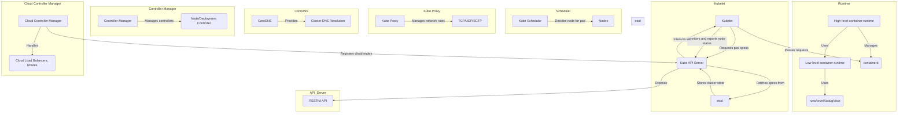

# Container Orchestration

**Container orchestration automates the operational tasks required to run containers.**

- This includes tasks such as:
  - Scaling containerized applications up or down
  - Managing resource allocation (e.g., CPU, memory)
  - Handling rolling updates and deployments
  - Monitoring application health and performance
  - Providing high availability and fault tolerance.
  - Orchestration tools help ensure that containers are running smoothly, efficiently, and in a way that aligns with the needs of the application.

## Key features of container orchestration

1. **Provisioning and Deployment**: Simplifies the setup and deployment of containers.
2. **Self-Healing and Scheduling**: Ensures container availability and optimal use of compute resources.
3. **Service Exposure**: Makes containers network-accessible.
4. **Authorization and Security**: Implements secure access and operations.
5. **Storage Management**: Supports shared and persistent storage for workloads.
6. **Auto-Scaling**: Adjusts resources based on demand.
7. **Extended Functionality**: Custom Resource Definitions (CRDs) in Kubernetes allow expanding beyond core functionalities (e.g., a MySQL CRD for managing MySQL instances).

### Advantages of container orchestration

- Standardizes the deployment process and integrates with various components like networking, storage, security, and autoscaling.
- This enables developers to focus on writing code, rather than worrying about the underlying infrastructure.
- Orchestrators available are: Nomad, Openshift, Docker, and Kubernetes.
- Openshift provide additional functionality and a support model to Kubernetes.
- Kubernetes is widely regarded as the gold standard for Container Orchestration due to its robust feature set, large community support, and widespread adoption across industries and organizations. Originally developed by Google and later open-sourced, Kubernetes has become the de facto standard for container orchestration and management.
- CRDs (Custom Resource Definitions) are a means of expanding Kubernetes to have functionality outside of its core features.
- CRDs allow developers to define new resources and APIs that can be used to extend the Kubernetes platform.
- By creating custom resources, developers can add new features and functionality to their clusters without having to modify the underlying Kubernetes codebase.

## Kubernetes Architecture

![[Kubernetes API Architecture3.png]]

### High-Level Overview

- Kubernetes architecture is divided into **two main areas**:
  - **Control Plane**: Manages the cluster.
  - **Nodes**: Where workloads (containers) run.
- Initially, the architecture is explained with a **single control plane and a node**, then expanded to a **highly available cluster**.

---



#### 1. Container Runtime

- **Low-level container runtime**: Directly interacts with Linux namespaces and `cgroups`.
  - Example: `runc` (OCI-compatible, originally from Docker).
    - `runc` was donated by Docker and is an OCI Compatible Container Runtime
  - Alternatives: `crun`, `Kata Containers`, `gVisor`.
- **High-level container runtime (Container Engine)**: Manages the full container lifecycle.
  - Example: `containerd` (used by Docker, now CNCF graduated).
  - It pulls, stores, supervises, and executes containers using a low-level runtime.

---

#### 2. Kubelet

- Runs on both **control plane and worker nodes** (not just nodes).
- **Role**: Ensures pods are running and healthy.
- Reads pod specs from:
  - API calls.
  - YAML files in `/etc/kubernetes/manifests` (for **static pods**).
- Passes requests to `containerd`.

---

#### 3. etcd (Key-Value Store)

- **Stores all cluster data** and maintains the cluster state.
- A **distributed, strongly consistent** store.
- In production, use **multiple instances (odd-numbered, e.g., 5 members)**.
- Supports **leader election, fault tolerance, and network partitions**.
- **Backups are critical** for disaster recovery.
- Runs as a **static pod**

---

#### 4. Kube API Server

- **Main access point** to the Kubernetes cluster.
- Exposes a **RESTful API**.
- Stores all data in **etcd**.
- **Interacts with Kubelet** for pod creation.
- Runs as a **static pod**

---

#### 5. Kube Scheduler

- Determines **which node** a pod should run on.
- Considers:
  - **Resource availability**.
  - **Node constraints**.
- Runs as a **static pod** (defined in YAML files).

---

#### 6. Kube Proxy

- **Handles network connectivity** in Kubernetes.
- Runs as a **DaemonSet** (on **every node**).
- Manages **TCP, UDP, SCTP** forwarding rules dynamically.
- Not a static pod, but a **regular pod managed by Kubernetes**.

---

#### 7. CoreDNS

- **Provides cluster DNS resolution**.
- Runs as a **Deployment** (unlike static pods).
- Ensures service discovery using **DNS-based communication**.

---

#### 8. Controller Manager

- Manages **controllers** (control loops that enforce the desired state).
- Examples:
  - **Node controller**: Detects offline nodes.
  - **Deployment controller**: Manages pod replicas.

---

#### 9. Cloud Controller Manager (CCM)

- **Bridges Kubernetes with cloud providers**.
- Automates:
  - Cloud **load balancer integration**.
  - **Route configuration**.
- Typically used in **public cloud Kubernetes deployments (e.g., AWS, GCP, Azure).**

---

### High Availability (HA) Kubernetes Cluster

- Uses **multiple control plane nodes** for fault tolerance.
- **etcd runs as a cluster** with **Raft consensus** for data consistency.
- API Server is **load-balanced** across control planes.
- Nodes communicate with **any available control plane** for scheduling and API interactions.

---

### Kubernetes Cluster Workflow

1. **User (`kubectl`) → API Server**
   - Sends a request (e.g., create an `nginx` pod).
2. **API Server → etcd**
   - Stores the request.
3. **Scheduler → Assigns Node**
   - Picks a node for the pod.
4. **Kubelet → Container Runtime (`containerd` → `runC`)**
   - Creates the pod on the assigned node.
5. **Service Exposure (`kube-proxy`, `CoreDNS`)**
   - Ensures network connectivity for the pod.

---

### Key Takeaways for Kubernetes Labels

- **Control Plane**: Manages the cluster (`API Server`, `etcd`, `Scheduler`, `Controller Manager`).
- **Nodes**: Run workloads (`Kubelet`, `kube-proxy`, `container runtime`).
- **High availability** ensures redundancy and fault tolerance.
- **Kubernetes automates scheduling, networking, and scaling** for containers.
- Static pods (API Server, etcd, scheduler)

## Pod Basics

- A **Pod** is the smallest deployable unit in Kubernetes.
- It consists of **one or more containers** sharing networking and storage.
- Containers inside a pod communicate via **localhost**.
- Each pod gets a **unique IP address** within the cluster.
- Each Pod in Kubernetes is automatically associated with a Service Account.
- This association is key to determining the permissions and resources that the processes inside the Pod will have access to.
- If you don’t specify a Service Account for a Pod, it defaults to using the 'default' Service Account in the same namespace and the Pod will have limited access to the Kubernetes API from within the Pod.

### Creating and Managing a Pod

- Run an **nginx pod**:
  `kubectl run nginx --image=nginx`
- Check pod status:
  `kubectl get pods`
- View pod logs:
  `kubectl logs nginx`
- Get detailed pod information (including IP and node details):
  `kubectl get pods -o yaml`

### Accessing a Pod

- Pods are accessible within the cluster via their **IP addresses**.
- External access requires **port forwarding**:
  `kubectl port-forward nginx 8080:80`
- Access nginx via `localhost:8080`.

### Inter-Pod Communication

- **Using a temporary curl pod** to test communication:

  ```bash
  kubectl run curl --image=curlimages/curl --rm -it --restart=Never -- curl <nginx-pod-IP>
  ```

- **Using an Ubuntu pod** for interactive testing:

```bash
kubectl run ubuntu --image=ubuntu --command -- sleep infinity
```

- Exec into the Ubuntu pod:

    ```bash
    kubectl exec -it ubuntu -- bash
    ```

- Install `curl` and test access to nginx.

### Cleanup

- Delete the created pods:
  `kubectl delete pod nginx ubuntu --now`

### Alternative Pod Creation

- Instead of the CLI, **YAML manifests** can be used to define pods declaratively.

### Using YAML to Create Kubernetes Pods

#### Introduction to YAML

- YAML is a simple data serialization language commonly used for configuration files.
- Kubernetes resources (pods, deployments, etc.) can be defined using YAML.
- **kubectl** can generate YAML for existing resources.

#### Generating YAML for a Pod

- Create an **nginx pod** and output its YAML:
  `kubectl run nginx --image=nginx --dry-run=client -o yaml | tee nginx.yaml`
- This displays the YAML and saves it to `nginx.yaml`.

#### Understanding YAML Fields

- The **restartPolicy** field defines how Kubernetes handles pod failures:
  - `Always` (default) → Pod restarts automatically.
  - `Never` → Pod never restarts.
  - `OnFailure` → Pod restarts only if it fails.
- To get details about any YAML field, use:
  `kubectl explain pod.spec.restartPolicy`

#### Applying YAML Files

- **Imperative vs. Declarative Approach**:
  - `kubectl create -f file.yaml` → Creates a resource but fails if it already exists.
  - `kubectl apply -f file.yaml` → Ensures the resource exists and updates it if needed.
- Example:
  `kubectl create -f nginx.yaml kubectl apply -f nginx.yaml`

#### Generating and Applying Multiple YAML Files

- Generate a **YAML file for an Ubuntu pod**:
  `kubectl run ubuntu --image=ubuntu --dry-run=client -o yaml | tee ubuntu.yaml`
- Apply both YAML files:

  ```bash
  kubectl apply -f nginx.yaml
  kubectl apply -f ubuntu.yaml
  ```

- Delete the created pods:
  `kubectl delete pod nginx ubuntu --now`

#### Combining Multiple YAML Declarations

- Kubernetes allows multiple resources in a single YAML file, separated by `---`.
- Merge `nginx.yaml` and `ubuntu.yaml` into one file:

  ```bash
  { cat nginx.yaml; echo "---"; cat ubuntu.yaml; } > combined.yaml
  ```

- Apply both resources with one command:
  `kubectl apply -f combined.yaml`

### Running a Kubernetes Pod with Multiple Containers

#### From Single-Container to Multi-Container Pods

- Previously, each pod contained a single container.
- Now, we create **one pod with two containers**.
- The second container acts as a **sidecar**, a common pattern in Kubernetes.
- A sidecar is a container to execute a specific pod in a container.

#### Editing the YAML File

- In YAML, `-` represents a **list** (e.g., list of containers in a pod).
- Combine both containers into a **single pod**:
  - Move the second container into the `containers` list of the first pod.
  - Remove redundant sections.
  - Maintain consistency in structure (e.g., placing `name` before `image`).
- Update:
  - **Pod name** → `my-pod`
  - **Container names**:
    - `nginx` → **web-server**
    - `ubuntu` → **sidecar**

#### Adding Functionality to the Sidecar

![[Kubernetes Fundamentals sidecar pod.png]]

- Modify the **Ubuntu sidecar container**:
  - Run a shell command in a `while true` loop.
  - **Echo "Hello from the sidecar" every 5 seconds**.
  - Stop execution if a file `/tmp/crash` exists.

#### Deploying and Verifying the Pod

- Apply the YAML:

  `kubectl apply -f my-pod.yaml`

- Verify the running pod:

  `kubectl get pods`

  - **Ready column** shows `2/2`, meaning **two containers are running in one pod**.
  - Pod has **one IP address**, shared between containers.

#### Inspecting the Pod

- Check pod details:

  `kubectl describe pod my-pod`

- Access the **web server**:
  `kubectl run -it --rm --image=curlimages/curl --restart=Never curl -- http://10.42.2.6`

- View **sidecar logs**:

  `kubectl logs my-pod -c sidecar`

#### Simulating a Container Crash

- Trigger a crash by creating `/tmp/crash` inside the **sidecar** container:

  `kubectl exec my-pod -c sidecar -- touch /tmp/crash`

- Check pod status:

  `kubectl get pods`

  - Sidecar container **restarts** (restart count increases).

- View logs **before the crash**:

  `kubectl logs my-pod -c sidecar -p`

#### Cleanup Resources

- Remove the pod and YAML files:

  `kubectl delete pod my-pod rm my-pod.yaml`

#### Key Takeaways for Kubernetes Labels and Usage

- **Sidecars** enhance pod functionality by running alongside the main container.
- **Multi-container pods** share the same network and storage.
- **Logs can be checked before and after a container crash** using `-p` flag.
- **Declarative YAML** is preferred for managing Kubernetes objects.

## Namespaces

### Understanding Namespaces

- Kubernetes namespaces **divide cluster resources** between users, applications, or projects.
- **Analogy**: A Kubernetes cluster is like a **town**, where:
  - **Buildings** = Namespaces
  - **Rooms in buildings** = Pods within a namespace
  - **Furniture in rooms** = Resources within pods
- This setup enables **isolation** while being part of the same cluster.

### Why Use Namespaces?

1. **Multi-Tenancy** – Enables multiple teams to share infrastructure securely.
2. **Resource Quotas** – Set limits on memory and CPU usage within a namespace.
3. **Limit Ranges** – Define minimum and maximum resources for each pod or container.
4. **Security & Access Control** – Role-Based Access Control (**RBAC**) restricts access to namespaces.
5. **Organization & Simplification** – Namespaces allow duplicate resource names without conflict.

---

### Exploring Kubernetes Namespaces in Practice

#### Viewing Existing Namespaces

- List all resources across **all namespaces**:
  `kubectl get all -A`

- List **default namespaces**:

  `kubectl get namespaces`

- **Common namespaces**:
  - `kube-system` – Kubernetes system resources.
  - `kube-public` – Readable by all users, even unauthenticated ones.
  - `kube-node-lease` – Holds node heartbeat information.

#### Working with Namespaces

- **Short commands**: `kubectl get namespaces` can be shortened to:

  `kubectl get ns`

- **Check if a resource is namespaced**:

  `kubectl api-resources`

  - List API resources in the current k8s cluster
  - Namespaced resources (e.g., Pods) exist **within** a namespace.
  - Non-namespaced resources (e.g., Nodes) exist **cluster-wide**.

#### Creating and Using Namespaces

1. **Create a namespace**:

   `kubectl create namespace my-namespace`

2. **Run a pod in the new namespace**:

   `kubectl run nginx --image=nginx -n my-namespace`

3. **View pods within a namespace**:

   `kubectl get pods -n my-namespace`

4. **Set a default namespace for the session**:

   `kubectl config set-context --current --namespace=my-namespace`

5. **Revert back to default namespace**:

   `kubectl config set-context --current --namespace=default`

#### Deleting a Namespace

- **Remove namespace and all resources within it**:

  `kubectl delete namespace my-namespace`

---

### Key Takeaways for Kubernetes

- **Namespaces provide isolation** within a Kubernetes cluster.
- **RBAC, resource quotas, and limit ranges** enhance security and efficiency.
- **Commands like `-n` and `set-context`** allow easy namespace management.
- **Deleting a namespace removes all its resources** automatically.

## Deployments and ReplicaSets

A **Kubernetes Deployment** is a resource object that enables **declarative updates** for applications. It defines how applications should run, including **image versions**, **replica counts**, and **update strategies**. Deployments ensure availability during updates and provide rollback mechanisms in case of failures.

### Key Features of Deployments

1. **Pod Replication** – Ensures a specified number of pod instances are running at all times.
2. **Updates** – Allows gradual, rolling updates to prevent downtime.
3. **Rollbacks** – Enables reverting to a previous version in case of failures.
4. **ReplicaSet Management** – Deployments create and manage **ReplicaSets**, which control pod lifecycles.

---

### Practical Usage

#### 1. **Creating a Deployment**

```bash
kubectl create deployment nginx --image=nginx --dry-run=client -o yaml > nginx-deployment.yaml kubectl apply -f nginx-deployment.yaml
```

- This creates an **Nginx deployment** using a YAML definition.

#### 2. **Checking Deployment and ReplicaSets**

```bash
kubectl get deployments
kubectl get replicasets
kubectl get pods -o wide
```

#### 3. **Viewing Deployment History**

```bash
kubectl rollout history deployment/nginx
kubectl annotate deployment/nginx kubernetes.io/change-cause="Initial deployment"
```

#### 4. **Scaling Deployments**

```bash
kubectl scale deployment/nginx --replicas=10
watch kubectl get pods
```

- This scales the deployment from **1 to 10 replicas**.

#### 5. **Updating Deployments**

   ```bash
   kubectl set image deployment/nginx nginx=nginx:stable
   kubectl rollout status deployment/nginx
   ```

- This updates the **Nginx image** to a new version with **rolling updates**.

#### 6. **Handling Rollbacks**

   ```bash
   kubectl set image deployment/nginx nginx=nginx:bananas
   kubectl rollout undo deployment/nginx
   ```

- If an update fails, rolling back restores a stable version.

#### 7. **Rolling Back to a Specific Version**

   `kubectl rollout undo deployment/nginx --to-revision=1`

- This restores the deployment to **revision 1**.

#### 8. **Deleting a Deployment**

   `kubectl delete deployment/nginx`

- This removes the deployment along with associated **ReplicaSets** and **Pods**.

---

### Key Takeaways for Kubernetes Services

- Kubernetes **Deployments** provide a structured approach to application management.
- They enable **scalability, controlled updates, and rollback mechanisms**.
- **ReplicaSets** maintain the desired pod state, ensuring **high availability**.
- **Rolling updates and rollbacks** prevent application downtime.
- Deployment strategies like **MaxSurge** and **MaxUnavailable** control update behavior.

## Services

### Kubernetes Service Types Explained

Kubernetes services expose applications running on pods to the network.
There are **four primary service types**, plus one additional variant:

#### 1. **ClusterIP (Default)** – Provides an internal IP reachable only within the cluster

```yaml
  apiVersion: v1
  kind: Service
  metadata:
    name: nginx-clusterip
  spec:
    selector:
    app: nginx
    ports:
    - protocol: TCP
      port: 80
      targetPort: 80
    type: ClusterIP # Optional (default type)

```

- Example: `kubectl expose deployment/nginx --port=80`
- Accessed via Kubernetes DNS (`nginx.default.svc.cluster.local`).

#### 2. **NodePort** – Exposes the service on a static port on each node, accessible externally if node IPs are reachable

```yaml
apiVersion: v1
kind: Service
metadata:
 name: nginx-nodeport
spec:
 selector:
   app: nginx
 ports:
   - protocol: TCP
     port: 80
     targetPort: 80
     nodePort: 30080  # Optional, Kubernetes assigns a port if not specified (range: 30000-32767)
 type: NodePort
```

- Example: `kubectl expose deployment/nginx --type=NodePort --port=80`
- Access `http://<NodeIP>:30080` from outside the cluster.

#### 3. **LoadBalancer** – Provides an external IP using a cloud provider’s load balancer (e.g., AWS, GCP)

   ```yaml
   apiVersion: v1
   kind: Service
   metadata:
     name: nginx-loadbalancer
   spec:
     selector:
       app: nginx
     ports:
       - protocol: TCP
         port: 80
         targetPort: 80
     type: LoadBalancer
   ```

- Example: `kubectl expose deployment/nginx --type=LoadBalancer --port=8080 --target-port=80`
- Balances traffic across pods automatically.
- Access `http://<ExternalLoadBalancerIP>:80` (assigned by the cloud provider).

#### 4. **ExternalName** – Maps a service to an external DNS name

   ```yaml
   apiVersion: v1
   kind: Service
   metadata:
     name: external-db
   spec:
     type: ExternalName
     externalName: my.database.example.com
   ```

- Example: `kubectl create service externalname my-service --external-name=my.database.example.com`
- Used for aliasing external resources.
- Access:
- Inside cluster: `http://external-db.default.svc.cluster.local`

- Resolves to `my.database.example.com`.

#### 5. **Headless Service (Variation of ClusterIP)** – Removes the cluster IP and provides direct DNS resolution to pod IPs

   ```yaml
   apiVersion: v1
   kind: Service
   metadata:
     name: nginx-headless
   spec:
     selector:
       app: nginx
     clusterIP: None
     ports:
       - protocol: TCP
         port: 80
         targetPort: 80
   ```

- Example: Setting `clusterIP: None` in the YAML.
- Enables direct pod communication without a proxy.

### Key Takeaways for Kubernetes ConfigMaps and Secrets

- Kubernetes services enable **service discovery** and **traffic routing**.
- **ClusterIP** is the default, while **NodePort** and **LoadBalancer** allow external access.
- **ExternalName** maps to external resources, and **Headless Services** allow direct pod access.
- **Services dynamically update endpoints** when pods scale up/down.

### Summary Table

| Service Type     | Internal Only | External Access     | Use Case                              |
| ---------------- | ------------- | ------------------- | ------------------------------------- |
| **ClusterIP**    | ✅ Yes        | ❌ No               | Internal communication                |
| **NodePort**     | ✅ Yes        | ✅ Yes (Node IP)    | Access from outside the cluster       |
| **LoadBalancer** | ✅ Yes        | ✅ Yes (Cloud LB)   | External access in cloud environments |
| **ExternalName** | ❌ No         | ✅ Yes (DNS Alias)  | External service aliasing             |
| **Headless**     | ✅ Yes        | ❌ No (Direct Pods) | Stateful apps & service discovery     |

## Kubernetes Jobs

- A **Job** manages **batch tasks** by creating **pods that run to completion**.
- Handles execution, **tracking progress**, and **retries on failure**.
- Use cases:
  - Data processing tasks
  - System backups
  - Sending emails

### Example: Calculating Pi

```yaml
apiVersion: batch/v1
kind: Job
metadata:
  name: calculate-pi
spec:
  template:
    spec:
      containers:
        - name: pi
          image: perl
          command: ["perl", "-Mbignum=bpi", "-wle", "print bpi(2000)"]
      restartPolicy: Never
```

- Runs a **Perl container** to calculate **π (Pi) to 2000 decimal places**.
- `kubectl create job calculatepi` is used to create a new Kubernetes job named "calculatepi".
- The job **completes and exits**.

### Parallelism & Completions

- `completions: 20` → **20 pods** run in total.
- `parallelism: 5` → **Only 5 pods run concurrently**.

```yaml
spec:
  completions: 20
  parallelism: 5
```

---

### Kubernetes CronJobs

- **CronJobs** schedule jobs **at regular intervals**, like Unix **cron**.
- Each scheduled run creates a **Job**, which in turn creates a **pod**.
- Each time a CronJob runs (e.g., every hour), it generates a new Job object that then triggers the creation of Pods to perform the actual work defined within the Job.

#### Example: Run Pi Calculation Every Minute

```yaml
apiVersion: batch/v1
kind: CronJob
metadata:
  name: calculate-pi
spec:
  schedule: "* * * * *" # Runs every minute
  jobTemplate:
    spec:
      template:
        spec:
          containers:
            - name: pi
              image: perl
              command: ["perl", "-Mbignum=bpi", "-wle", "print bpi(2000)"]
          restartPolicy: Never
```

- Runs **every minute** (`* * * * *`).

#### Retention Settings

```yaml
apiVersion: batch/v1
kind: CronJob
metadata:
  name: my-cronjob
spec:
  schedule: "*/1 * * * *"
  jobTemplate:
    spec:
   ttlSecondsAfterFinished: 600 # Delete job 10 minutes after completion
      template:
        spec:
          containers:
          - name: my-container
            image: my-image
      backoffLimit: 4
  successfulJobsHistoryLimit: 5 # Keeps 5 completed jobs
  failedJobsHistoryLimit: 2 # Keeps 2 failed job
```

- Kubernetes will keep **5 successful Jobs** (`successfulJobsHistoryLimit`) (default: 3) even if they are completed long ago.
- If there are **more than 2 failed Jobs** (`failedJobsHistoryLimit`) (default: 1) it will remove the oldest ones. By default, 1 job is kept for job analysis.

---

1. **Deletion of the CronJob Object**:

   - The **CronJob resource itself is deleted**, which means it will no longer schedule future jobs.
   - However, **existing jobs triggered by the CronJob are not automatically deleted** by default, and they will continue to run or complete.

```bash
kubectl get jobs --field-selector status.failed>0
kubectl get pods --selector=job-name=<job-name>
kubectl get pods --field-selector=status.phase=Failed
kubectl logs -p <pod-name>
```

1. **Deletion of Associated Jobs and Pods**:

   - **Existing Jobs and pods** that were created by the CronJob but have not yet completed **remain in the system** unless they are manually deleted.
   - If there are **pods running under those Jobs**, they will continue until their associated Jobs finish. The pods are not killed just because the CronJob was deleted.
   - These **Jobs are not automatically cleaned up** unless explicitly configured to be cleaned based on their successful or failed status or manually deleted.

2. **Retention of Jobs**:

   - The jobs that have already been created will remain in the cluster unless their **`successfulJobsHistoryLimit`** or **`failedJobsHistoryLimit`** is reached. Once this limit is hit, older jobs are cleaned up based on the specified retention policy.

3. **Manual Cleanup Required**:

   - If you want to remove all the **Jobs** and **pods** created by the CronJob, you would have to manually delete them using `kubectl delete jobs` or `kubectl delete pods`.

4. **Job History**:

   - The **job history** for past executions may still be retained in the cluster, depending on the settings like `successfulJobsHistoryLimit` and `failedJobsHistoryLimit`.

### Example

When you delete a CronJob:

`kubectl delete cronjob <cronjob-name>`

You should also ensure that any leftover Jobs and Pods are cleaned up if necessary:

```bash
kubectl delete jobs --selector=job-name=<cronjob-name> kubectl delete pods --selector=job-name=<cronjob-name>
```

---

### Key Takeaways for Kubernetes Secrets

| Feature             | Job    | CronJob                               |
| ------------------- | ------ | ------------------------------------- |
| Runs once           | ✅ Yes | ❌ No                                 |
| Runs on a schedule  | ❌ No  | ✅ Yes                                |
| Automatic retries   | ✅ Yes | ✅ Yes                                |
| Parallel execution  | ✅ Yes | ✅ Yes                                |
| Retains job history | ❌ No  | ✅ Yes (`successfulJobsHistoryLimit`) |

## Config Maps

- **ConfigMaps** allow you to store configuration data, environment variables, and other information that can be used by your application. They provide a flexible solution for managing configuration across different scenarios.

### Creating ConfigMaps

1. **CLI Approach**:

   - Use `kubectl create configmap` to create a ConfigMap with literal key-value pairs.
   - Example:

     ```bash
     kubectl create configmap color-configmap --from-literal=color=red --from-literal=key=value
     ```

   - You can also view it using `kubectl describe configmap color-configmap`.

2. **File-based Approach**:

   - You can create ConfigMap from files or environment files.
   - Example:

     ```bash
     kubectl create configmap color-configmap --from-env-file=filename
     ```

### Using ConfigMaps in Pods

1. **Using Environment Variables**:

   - To inject ConfigMap values into a pod's environment, you can specify the ConfigMap under the `envFrom` section in the pod’s YAML.
   - Example YAML:

     ```yaml
     spec:
       containers:
         - name: ubuntu
           image: ubuntu
           envFrom:
             - configMapRef:
               name: color-configmap
     ```

2. **Reusing ConfigMaps**:

   - If you edit a ConfigMap, such as changing values, the associated pods can automatically pick up those changes (if they are re-started).
   - Example: If you change the `color` value in the ConfigMap from `green` to `red`, your pods referencing that ConfigMap will show the updated value upon restart.

### Immutability of ConfigMaps

- **Immutable ConfigMaps**: Since Kubernetes 1.21, ConfigMaps can be made immutable using the `immutable: true` field. Once a ConfigMap is set to immutable, it cannot be modified. Any changes require deleting and recreating the ConfigMap.

#### Example of Immutability

- Editing a ConfigMap that is marked as immutable will result in an error, and the only way to modify the ConfigMap is **by deleting it and creating a new one**.

### Clean-up

- After using the ConfigMap, you can clean up by deleting the pod and ConfigMap:
  `kubectl delete pod ubuntu configmap color-configmap --now`

## Secrets in Kubernetes

A **Secret** in Kubernetes is an object used to store **sensitive information**, such as passwords, API keys, tokens, or other confidential data. Using Secrets prevents you from hardcoding sensitive information directly into your application code or ConfigMaps.

In Kubernetes, secrets are stored in `etcd`, which is a distributed key-value store. While secrets are encoded in base64 format, if someone gains access to etcd or retrieves the secret as YAML, they can easily decode the value and obtain sensitive information such as passwords, API keys, or certificates.

### Creating a Secret

- You can create a Secret using the Kubernetes CLI:

```bash
kubectl create secret generic color-secret --from-literal=color=red --from-literal=key=value
```

- When creating a generic secret in Kubernetes, the type assigned is indeed "Opaque".
- The term "Opaque" signifies that the secret's contents are not specific to any particular type or format, making it a catch-all for secrets that don't fit into other predefined categories.

- To see the YAML output:
  `kubectl get secret color-secret -o yaml`
- Another way to see the yaml specification

```bash
kubectl create secret generic color-secret --from-literal=COLOR=red --from-literal=KEY=value --dry-run=client -o yaml
```

```yaml
apiVersion: v1
data:
  COLOR: cmVk
  KEY: dmFsdWU=
kind: Secret
metadata:
  creationTimestamp: null
  name: color-secret
```

#### Secrets Are Base64 Encoded, Not Encrypted

- Secrets **appear encrypted** in the YAML output, but they are only **Base64 encoded**.
- Example: Encoding and decoding a string manually:
  `echo -n "value" | base64 echo "dmFsdWU=" | base64 -d`

- **Important Security Note:** Kubernetes **stores Secrets in etcd**, which should be properly secured and encrypted at rest.

#### Using a Secret in a Pod

- Let's create a pod yaml file

```bash
kubectl run --image=ubuntu --dry-run=client --restart=Never -o yaml ubuntu --command bash -- -c 'env; sleep infinity;' > env-dump.yaml
```

- Edit the yaml to inject, and associtate to the secret.
- Secrets injected into a pod as environment variables, similar to ConfigMaps:

  ```yaml
  spec:
  containers:
    - name: ubuntu
      image: ubuntu
      envFrom:
        - secretRef:
          name: color-secret
  ```

- This will load the Secret as environment variables in the container.

#### Cleaning Up

- To delete the Secret and related resources:
   `kubectl delete pod ubuntu secret color-secret --now`

### Key Takeaways

- Secrets help manage sensitive data securely.
- They are **Base64-encoded**, not encrypted by default.
- Kubernetes stores them in etcd, so **restrict etcd access** and enable **encryption at rest** for better security.
- If you're familiar with ConfigMaps, using Secrets is straightforward since the usage is almost identical.

### Secrets vs. ConfigMaps

- **Use Secrets** for confidential data (e.g., API keys, passwords, certificates), such as passwords, API keys, or certificates.
- **Use ConfigMaps** for non-sensitive configuration (e.g., environment variables, application settings).
- ConfigMaps are used to store non-secret configuration data such as environment variables, port numbers, or other application settings. The main difference between the two is that Secrets are encrypted at rest and in transit, whereas ConfigMaps are not.
- Both objects have a **similar usage pattern**, but Secrets provide additional security measures.

## Labels in Kubernetes

**Labels** in Kubernetes are key-value pairs used to tag and organize resources. They help categorize and manage Kubernetes objects efficiently by allowing **grouping, selection, and filtering** of resources.

Many Kubernetes components use labels to select the resources they should operate on. This includes but is not limited to **ReplicaSets** selecting Pods for scaling, **Services** routing traffic to Pods based on their labels, and **Deployments** managing rollouts of new versions by labeling Pods with specific version numbers. Labels provide a powerful mechanism for decoupling component logic from specific resource identities.

### Why Use Labels?

- **Resource Organization**: Group related resources (e.g., by application, team, or environment).
- **Automation**: CI/CD pipelines can use labels to determine deployment targets. E.g., CI/CD can use labels to identify an application to be deployed.
- **Service Discovery & Load Balancing**: Services use labels to identify pods for routing traffic.
- **Network Policies**: Define rules for communication between pods using label selectors. E.g., to tell how pods should communicate with each other.
- **Environment Segmentation**: Labels can separate resources into **dev, test, and production** environments.

#### Creating and Using Labels

1. **Creating a Pod with Labels**
   `kubectl run nginx --image=nginx --port=80 --labels="app=web,env=prod"`

2. **Exposing a Pod as a Service**
   `kubectl expose pod nginx --port=80 --target-port=80 --dry-run=client -o yaml`

   - The service uses **label selectors** to target resources with `app=web`.
3. **Filtering Resources by Labels**

   ```bash
   kubectl get pods --selector app=web
   kubectl get all -l env=prod
   ```

#### Example: Labeling Multiple Pods

##### 1. Create a **YAML file** for labeled pods

```yaml
apiVersion: v1
kind: Pod
metadata:
  name: ubuntu-red
  labels:
    color: red
spec:
  containers:
  - name: ubuntu
    image: ubuntu
    command: ["sleep", "infinity"]
---
apiVersion: v1
kind: Pod
metadata:
  name: ubuntu-green
  labels:
    color: green
spec:
  containers:
  - name: ubuntu
    image: ubuntu
    command: ["sleep", "infinity"]
```

##### 2. Apply the configuration

   `kubectl apply -f colored_pods.yaml`

##### 3. Query resources using labels

   `kubectl get pods --selector color=green`

#### Final Thoughts on Kubernetes Labels

- Labels help **categorize and organize** Kubernetes resources.
- Designating that resources belongs to groups such as `development`, `testing`, or `production`
- **Label selectors** allow filtering and managing specific resource groups.
- Kubernetes uses labels in **service discovery, network policies, and CI/CD automation**.
- Use `--selector` or `-l` to query resources efficiently.
- `--selector`: **Full form** of the option, explicitly stating that it's a selector.
- `-l`: **Short form** (alias) of `--selector`.

By implementing a **well-structured labeling strategy**, you can improve resource management, automation, and scaling within your Kubernetes cluster. This includes better resource management, easier rollouts and rollbacks, and more targeted monitoring and logging.

Effective use of Kubernetes labels can contribute to better cloud cost management by allowing administrators to identify and delete unused or idle resources. Labels provide a way to categorize and filter resources, making it easier to detect waste and optimize resource utilization. By deleting unnecessary resources, organizations can avoid paying for idle capacity.

> #flashcards
