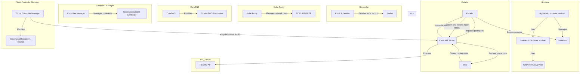

---
tags:
  - Kubernetes
  - container-orchestration
  - KCNA
  - certification
title: Kubernetes Fundamentals
category: KCNA Notes
topics:
  - Kubernetes
  - Container Orchestration
  - CRDs
  - Kubernetes Architecture
  - Pods
  - Deployments
  - Services
  - ConfigMaps
  - Secrets
  - Labels
created: 2025-03-31
updated: 2025-03-31
author: reissada
status: draft
summary: This note covers Kubernetes fundamentals, including container orchestration, key features, architecture, pods, deployments, services, ConfigMaps, Secrets, and labels. It also explores Kubernetes' role as the gold standard for container orchestration.
---

# Kubernetes Fundamentals

## Kubernetes

- Inspired by Google’s internal **Borg** system, used for container and workload orchestration.
- **Open-source project**, written in **Go** and licensed under **Apache License 2.0**.
- Initially developed by **Google** and donated to the **Cloud Native Computing Foundation (CNCF)** in **July 2015**.
- Releases new versions every **4 months**.
- The **current stable version is 1.29** (as of December 2023).

### Features

- **Automatic bin packing**: Schedules containers based on resource needs to optimize utilization without sacrificing availability.
- **Designed for extensibility**: Can be extended with custom features without modifying upstream source code.
- **Self-healing**: Replaces/reschedules failed containers; restarts unresponsive containers; stops routing traffic to unhealthy containers.
- **Horizontal scaling**: Scales applications manually or automatically based on CPU or custom metrics.
- **Service discovery & load balancing**: Assigns IPs and DNS names to balance traffic across containers.
- **Automated rollouts & rollbacks**: Updates applications/configurations while monitoring health to avoid downtime.
- **Secret & configuration management**: Manages sensitive data separately from container images to avoid rebuilds; keeps secrets confidential.
- **Storage orchestration**: Automatically mounts storage from local, cloud, distributed, or network sources.
- **Batch execution**: Supports batch jobs, long-running jobs, and replacement of failed containers.
- **IPv4/IPv6 dual-stack**: Supports both IPv4 and IPv6 addresses.

✅ Kubernetes also supports **PaaS-like features** (deployment, scaling, load balancing) while allowing integration of custom monitoring, logging, and alerting tools.

ℹ️ Some features started as **alpha/beta** (e.g., **RBAC stable since v1.8**, **CronJobs stable since v1.21**) and become more valuable as they mature.

---

### Installing Kubernetes

#### Kubernetes Configuration

- **All-in-One Single-Node Installation**  
    In this setup, all the control plane and worker components are installed and running on a single-node. While it is useful for learning, development, and testing, it is not recommended for production purposes.
- **Single-Control Plane and Multi-Worker Installation**  
    In this setup, we have a single-control plane node running a stacked etcd instance. Multiple worker nodes can be managed by the control plane node.
- **Single-Control Plane with Single-Node etcd, and Multi-Worker Installation**  
    In this setup, we have a single-control plane node with an external etcd instance. Multiple worker nodes can be managed by the control plane node.
- **Multi-Control Plane and Multi-Worker Installation**  
    In this setup, we have multiple control plane nodes configured for High-Availability (HA), with each control plane node running a stacked etcd instance. The etcd instances are also configured in an HA etcd cluster and multiple worker nodes can be managed by the HA control plane.
- **Multi-Control Plane with Multi-Node etcd, and Multi-Worker Installation**  
    In this setup, we have multiple control plane nodes configured in HA mode, with each control plane node paired with an external etcd instance. The external etcd instances are also configured in an HA etcd cluster, and multiple worker nodes can be managed by the HA control plane. This is the most advanced cluster configuration recommended for production environments.

---
#### Local Learning Clusters

- [Minikube](https://minikube.sigs.k8s.io/docs/)  
    Single- and multi-node local Kubernetes cluster, recommended for a learning environment deployed on a single host.
- [Kind](https://kind.sigs.k8s.io/)  
    Multi-node Kubernetes cluster deployed in Docker containers acting as Kubernetes nodes, recommended for a learning environment.
- [Docker Desktop](https://www.docker.com/products/docker-desktop)  
    Including a local Kubernetes cluster for Docker users.
- [Podman Desktop](https://podman-desktop.io/)  
    Including Kubernetes integration for Podman users.
- [MicroK8s](https://microk8s.io/)  
    Local and cloud Kubernetes cluster for developers and production, from Canonical.
- [K3S](https://k3s.io/)  
    Lightweight Kubernetes cluster for local, cloud, edge, IoT deployments, originally from Rancher, currently a CNCF project.

---

#### Deployments Tools

✅ **1. kubeadm**

- Official Kubernetes tool to **bootstrap a production-ready cluster**.
- Supports **multi-node** and **Highly Available (HA)** clusters (on-premises or cloud).
- Does **not provision infrastructure**—you must manually create the servers.
- Flexible and extendable for custom setups.

---

✅ **2. kubespray**

- Based on **Ansible**: automates installation of **HA Kubernetes clusters**.
- Supports **AWS, GCP, Azure, OpenStack, vSphere, bare metal**.
- Good for **multi-platform deployments** and customization.

---

✅ **3. kops**

- CLI tool to **create, upgrade, manage Kubernetes clusters**.
- **Provisions infrastructure + installs Kubernetes** (all-in-one).
- Officially supports **AWS, GCE**; beta for DigitalOcean/OpenStack; alpha for Azure.
- Ideal for **cloud-based production clusters**.

---
## Kubernetes Architecture

![[Kubernetes API Architecture3.png]]

### High-Level Overview

- Kubernetes architecture is divided into **two main areas**:
  - **Control Plane**: Manages the cluster.
  - **Nodes**: Where workloads (containers) run.
- Initially, the architecture is explained with a **single control plane and a node**, then expanded to a **highly available cluster**.

---


#### 1. Container Runtime

- **Low-level container runtime**: Directly interacts with Linux namespaces and `cgroups`.
  - Example: `runc` (OCI-compatible, originally from Docker).
    - `runc` was donated by Docker and is an OCI Compatible Container Runtime
  - Alternatives: `crun`, `Kata Containers`, `gVisor`.
- **High-level container runtime (Container Engine)**: Manages the full container lifecycle.
  - Example: `containerd` (used by Docker, now CNCF graduated).
  - It pulls, stores, supervises, and executes containers using a low-level runtime.

---
#### 2. Kubelet

- Runs on both **control plane and worker nodes** (not just nodes).
- **Role**: 
	- Ensures pods are running and healthy.
	- Kubelet communicates with the API Server to receive instructions and report the status of the Node.
- Reads pod specs from:
  - API calls.
  - YAML files in `/etc/kubernetes/manifests` (for **static pods**).
- Passes requests to `containerd`.

---
#### 3. etcd (Key-Value Store)

- **Stores all cluster data** and maintains the cluster state.
- A **distributed, strongly consistent** store.
- In production, use **multiple instances (odd-numbered, e.g., 5 members)**.
- Supports **leader election, fault tolerance, and network partitions**.
- **Backups are critical** for disaster recovery.
- Runs as a **static pod**

---
#### 4. Kube API Server

- **Main access point** to the Kubernetes cluster.
- Exposes a **RESTful API**.
- Stores all data in **etcd**.
- **Interacts with Kubelet** for pod creation.
- Runs as a **static pod**

---
#### 5. Kube Scheduler

- Determines **which node** a pod should run on.
- Considers:
  - **Resource availability**.
  - **Node constraints**.
- Runs as a **static pod** (defined in YAML files).

---
#### 6. Kube Proxy

- **Handles network connectivity** in Kubernetes.
- Runs as a **DaemonSet** (on **every node**).
	- Not a static pod, but a **regular pod managed by Kubernetes**.
- Manages **TCP, UDP, SCTP** forwarding rules dynamically.

---
#### 7. CoreDNS

- **Provides cluster DNS resolution**.
- Runs as a **Deployment** (unlike static pods).
- Ensures service discovery using **DNS-based communication**.

--
#### 8. Controller Manager

- Manages **controllers** (control loops that enforce the desired state).
- Examples:
  - **Node controller**: Detects offline nodes.
  - **Deployment controller**: Manages pod replicas.

---
#### 9. Cloud Controller Manager (CCM)

- **Bridges Kubernetes with cloud providers**.
- Automates:
  - Cloud **load balancer integration**.
  - **Route configuration**.
- Typically used in **public cloud Kubernetes deployments (e.g., AWS, GCP, Azure).**

---
### High Availability (HA) Kubernetes Cluster

- Uses **multiple control plane nodes** for fault tolerance.
- **etcd runs as a cluster** with **Raft consensus** for data consistency.
- API Server is **load-balanced** across control planes.
- Nodes communicate with **any available control plane** for scheduling and API interactions.

---
### Kubernetes Cluster Workflow

1. **User (`kubectl`) → API Server**
   - Sends a request (e.g., create an `nginx` pod).
2. **API Server → etcd**
   - Stores the request.
3. **Scheduler → Assigns Node**
   - Picks a node for the pod.
1. **Kubelet → Container Runtime (`containerd` → `runc`)**
   - Creates the pod on the assigned node.
5. **Service Exposure (`kube-proxy`, `CoreDNS`)**
   - Ensures network connectivity for the pod.

---

### Key Takeaways for Kubernetes Labels

- **Control Plane**: Manages the cluster (`API Server`, `etcd`, `Scheduler`, `Controller Manager`).
- **Nodes**: Run workloads (`Kubelet`, `kube-proxy`, `container runtime`).
- **High availability** ensures redundancy and fault tolerance.
- **Kubernetes automates scheduling, networking, and scaling** for containers.
- Static pods (API Server, etcd, scheduler)

### Contro-Plane Components

#### **API Server**

- Central control plane component coordinating all administrative tasks.
- Handles **RESTful calls** from users, admins, operators, and external agents.
- Reads current cluster state from **etcd** and persists changes back to etcd.
- Acts as the **only component** communicating directly with etcd.
- Supports **horizontal scaling** and **custom secondary API Servers** for routing REST calls.

---

#### **Scheduler (kube-scheduler)**

- Assigns **pods/workloads** to nodes based on cluster state and workload requirements.
- Uses info from API Server & etcd to filter and prioritize nodes.
- Considers **constraints** (e.g., node labels), **QoS**, **affinity/anti-affinity**, **taints/tolerations**.
- Highly **configurable** with policies, plugins, profiles.
- Supports **custom schedulers** (selectable via object config).
- Essential for multi-node clusters; simpler role in single-node clusters.

---

#### **Controller Managers**

- Run continuous **watch-loops** to reconcile desired vs. current cluster state.
- **kube-controller-manager** handles node availability, pod counts, endpoints, service accounts, API tokens.
- **cloud-controller-manager** manages cloud infrastructure (nodes, storage, load balancing, routing).
- Automatically triggers corrective actions to match desired state.

---

#### **Key-Value Data Store (etcd)**

![[4 Kubernetes Fundamentals external etcd tipology.png]]
- Distributed, strongly consistent **key-value store** for persisting cluster state.
- Only **API Server** communicates with etcd.
- Uses **append-only writes**; periodically **compacts** obsolete data.
- Supports **snapshot backup & restore** via `etcdctl`.
- Deployment topologies:
    - **Stacked etcd**: etcd runs on same node as control plane components.
    - **External etcd**: etcd runs on dedicated nodes, isolated from control plane.
- Both topologies support **high availability (HA)** using the **Raft Consensus Algorithm**.
- Written in **Go**; also stores configs like **ConfigMaps, Secrets, subnets**.

---
### Worker Nodes Components

#### **Container Runtime**

- Kubernetes needs an external **container runtime** to run containers on each node (control plane & workers).
- Supported runtimes:
    - **CRI-O**: lightweight, OCI-compliant, supports Quay/Docker Hub registries.
    - **containerd**: simple, robust, used by Docker internally.
    - **Docker Engine**: uses containerd; deprecated direct integration.
    - **Mirantis Container Runtime**: previously Docker Enterprise.

---

#### **Node Agent – kubelet**

- **Agent on every node** (control plane & workers).
- Communicates with the API Server to receive Pod specs.
- Talks to the container runtime to **create/manage containers**.
- Monitors **Pod health & resource usage**.
- Uses **Container Runtime Interface (CRI)** for runtime interaction, supporting interchangeable runtimes via **CRI shims**.

---

#### **CRI Shims**

![[4 Kubernetes Fundamentals cri containerd.png]]
![[4 Kubernetes Fundamentals crio.png]]
![[4 Kubernetes Fundamentals dockershim to cri-dockerd.png]]
- Act as **adapters** between kubelet and different container runtimes.
- Examples:
    - **cri-containerd**: connects kubelet with containerd.
    - **CRI-O**: connects kubelet with any OCI runtime (e.g., runC).
    - **dockershim (deprecated in v1.24)** → replaced by **cri-dockerd** for Docker Engine support.

---

#### **Network Agent – kube-proxy**

- Runs on each node (control plane & workers).
- Manages **networking rules** and **traffic forwarding** for Pods.
- Handles TCP, UDP, SCTP traffic using **iptables** (Linux firewall utility).
- Supports **load balancing** across Pod backends via Service objects.

---

#### **Add-ons**

Optional features implemented via 3rd-party plugins/services:

- **DNS**: internal DNS records for cluster objects.
- **Dashboard**: web-based cluster management UI.
- **Monitoring**: collects metrics and stores centrally.
- **Logging**: gathers logs to a central log store.
- **Device Plugins**: advertises hardware (GPU, FPGA, NIC) to Pods.

---

### Networking Challenges

### **1. Container-to-Container Communication (within a Pod)**

- Each container runs in an **isolated network namespace** (via kernel features like namespaces in Linux).
- Kubernetes uses a **Pause container** to create a **shared network namespace** for all containers in a Pod.
- Containers in the same Pod can communicate via **localhost (127.0.0.1)**.

---

### **2. Pod-to-Pod Communication (across nodes)**

![[4 Kubernetes Fundamentals CNI Core plugins.png]]

- Pods must communicate **across nodes without NAT**—a **core Kubernetes networking requirement**.
- Kubernetes uses an **"IP-per-Pod"** model: each Pod gets a unique IP, like a VM with its own NIC.
- **Container Network Interface (CNI)** plugins configure networking for Pods and integrate with the container runtime to assign IPs.
    - Examples: **Flannel, Weave, Calico, Cilium**.
- Containers within a Pod share the Pod’s IP and coordinate port usage internally.

---

### **3. External-to-Pod Communication**

- External access to Pods is managed by **Kubernetes Services**.
- Services define **network routing rules** (stored in **iptables**) and exposed via **kube-proxy**.
- Applications are exposed externally via a **virtual IP + dedicated port** configured by Services.

---
## Cluster Info

- `kubectl cluster-info` - view information about the cluster
- `kubectl get nodes` - view information about the nodes

## Pod Basics

- A **Pod** is the smallest deployable unit in Kubernetes.
- It consists of **one or more containers** sharing networking and storage.
- Containers inside a pod communicate via **localhost**.
- Each pod gets a **unique IP address** within the cluster.
- Each Pod in Kubernetes is automatically associated with a Service Account.
- This association is key to determining the permissions and resources that the processes inside the Pod will have access to.
- If you don’t specify a Service Account for a Pod, it defaults to using the 'default' Service Account in the same namespace and the Pod will have limited access to the Kubernetes API from within the Pod.

### Creating and Managing a Pod

- Run an **nginx pod**:
  `kubectl run nginx --image=nginx`
- Check pod status:
  `kubectl get pods`
- View pod logs:
  `kubectl logs nginx`
- Get detailed pod information (including IP and node details):
  `kubectl get pods -o yaml`

### Accessing a Pod

- Pods are accessible within the cluster via their **IP addresses**.
- External access requires **port forwarding**:
  `kubectl port-forward nginx 8080:80`
- Access nginx via `localhost:8080`.

### Inter-Pod Communication

- **Using a temporary curl pod** to test communication:

```bash
kubectl run curl --image=curlimages/curl --rm -it --restart=Never -- curl <nginx-pod-IP>
```

- **Using an Ubuntu pod** for interactive testing:

```bash
kubectl run ubuntu --image=ubuntu --command -- sleep infinity
```

- Exec into the Ubuntu pod:

```bash
kubectl exec -it ubuntu -- bash
```

- Install `curl` and test access to nginx.

### Cleanup

- Delete the created pods:
  `kubectl delete pod nginx ubuntu --now`

### Alternative Pod Creation

- Instead of the CLI, **YAML manifests** can be used to define pods declaratively.

### Using YAML to Create Kubernetes Pods

#### Introduction to YAML

- YAML is a simple data serialization language commonly used for configuration files.
- Kubernetes resources (pods, deployments, etc.) can be defined using YAML.
- **kubectl** can generate YAML for existing resources.

#### Generating YAML for a Pod

- Create an **nginx pod** and output its YAML:
  `kubectl run nginx --image=nginx --dry-run=client -o yaml | tee nginx.yaml`
- This displays the YAML and saves it to `nginx.yaml`.

#### Understanding YAML Fields

- The **restartPolicy** field defines how Kubernetes handles pod failures:
  - `Always` (default) → Pod restarts automatically.
  - `Never` → Pod never restarts.
  - `OnFailure` → Pod restarts only if it fails.
- To get details about any YAML field, use:
  `kubectl explain pod.spec.restartPolicy`

#### Applying YAML Files

- **Imperative vs. Declarative Approach**:
  - `kubectl create -f file.yaml` → Creates a resource but fails if it already exists.
  - `kubectl apply -f file.yaml` → Ensures the resource exists and updates it if needed.
- Example:
  `kubectl create -f nginx.yaml kubectl apply -f nginx.yaml`

#### Generating and Applying Multiple YAML Files

- Generate a **YAML file for an Ubuntu pod**:
  `kubectl run ubuntu --image=ubuntu --dry-run=client -o yaml | tee ubuntu.yaml`
- Apply both YAML files:

```bash
kubectl apply -f nginx.yaml
kubectl apply -f ubuntu.yaml
```

- Delete the created pods:
  `kubectl delete pod nginx ubuntu --now`

#### Combining Multiple YAML Declarations

- Kubernetes allows multiple resources in a single YAML file, separated by `---`.
- Merge `nginx.yaml` and `ubuntu.yaml` into one file:

```bash
{ cat nginx.yaml; echo "---"; cat ubuntu.yaml; } > combined.yaml
```

- Apply both resources with one command:
  `kubectl apply -f combined.yaml`

### Running a Kubernetes Pod with Multiple Containers

#### From Single-Container to Multi-Container Pods

- Previously, each pod contained a single container.
- Now, we create **one pod with two containers**.
- The second container acts as a **sidecar**, a common pattern in Kubernetes.
- A sidecar is a container to execute a specific pod in a container.

#### Editing the YAML File

- In YAML, `-` represents a **list** (e.g., list of containers in a pod).
- Combine both containers into a **single pod**:
  - Move the second container into the `containers` list of the first pod.
  - Remove redundant sections.
  - Maintain consistency in structure (e.g., placing `name` before `image`).
- Update:
  - **Pod name** → `my-pod`
  - **Container names**:
    - `nginx` → **web-server**
    - `ubuntu` → **sidecar**

#### Adding Functionality to the Sidecar

![[Kubernetes Fundamentals sidecar pod.png]]

- Modify the **Ubuntu sidecar container**:
  - Run a shell command in a `while true` loop.
  - **Echo "Hello from the sidecar" every 5 seconds**.
  - Stop execution if a file `/tmp/crash` exists.

#### Deploying and Verifying the Pod

- Apply the YAML:
  `kubectl apply -f my-pod.yaml`

- Verify the running pod:
  `kubectl get pods`

  - **Ready column** shows `2/2`, meaning **two containers are running in one pod**.
  - Pod has **one IP address**, shared between containers.

#### Inspecting the Pod

- Check pod details:
  `kubectl describe pod my-pod`

- Access the **web server**:
```bash
kubectl run -it --rm --image=curlimages/curl --restart=Never curl -- http://10.42.2.6
```

- View **sidecar logs**:
  `kubectl logs my-pod -c sidecar`

#### Simulating a Container Crash

- Trigger a crash by creating `/tmp/crash` inside the **sidecar** container:
  `kubectl exec my-pod -c sidecar -- touch /tmp/crash`

- Check pod status:
  `kubectl get pods`

  - Sidecar container **restarts** (restart count increases).

- View logs **before the crash**:
  `kubectl logs my-pod -c sidecar -p`

#### Cleanup Resources

- Remove the pod and YAML files:

  `kubectl delete pod my-pod rm my-pod.yaml`

#### Key Takeaways for Kubernetes Labels and Usage

- **Sidecars** enhance pod functionality by running alongside the main container.
- **Multi-container pods** share the same network and storage.
- **Logs can be checked before and after a container crash** using `-p` flag.
- **Declarative YAML** is preferred for managing Kubernetes objects.

## Namespaces

### Understanding Namespaces

- Kubernetes namespaces **divide cluster resources** between users, applications, or projects.
- **Analogy**: A Kubernetes cluster is like a **town**, where:
  - **Buildings** = Namespaces
  - **Rooms in buildings** = Pods within a namespace
  - **Furniture in rooms** = Resources within pods
- This setup enables **isolation** while being part of the same cluster.

### Why Use Namespaces?

1. **Multi-Tenancy** – Enables multiple teams to share infrastructure securely.
2. **Resource Quotas** – Set limits on memory and CPU usage within a namespace.
3. **Limit Ranges** – Define minimum and maximum resources for each pod or container.
4. **Security & Access Control** – Role-Based Access Control (**RBAC**) restricts access to namespaces.
5. **Organization & Simplification** – Namespaces allow duplicate resource names without conflict.

### Default kubernetes namespaces

- `default`: automatically created when the cluster is setup.
- `kube-system`: created at cluster setup and contains a set of pods and services for internal purpose.
- `kube-public`: available to all users.

---

### Exploring Kubernetes Namespaces in Practice

#### Viewing Existing Namespaces

- List all resources across **all namespaces**:
  `kubectl get all -A`

- List **default namespaces**:

  `kubectl get namespaces`

- **Common namespaces**:
  - `kube-system` – Kubernetes system resources.
  - `kube-public` – Readable by all users, even unauthenticated ones.
  - `kube-node-lease` – Holds node heartbeat information.

#### Working with Namespaces

- **Short commands**: `kubectl get namespaces` can be shortened to:

  `kubectl get ns`

- **Check if a resource is namespaced**:

  `kubectl api-resources`

  - List API resources in the current k8s cluster
  - Namespaced resources (e.g., Pods) exist **within** a namespace.
  - Non-namespaced resources (e.g., Nodes) exist **cluster-wide**.

#### Creating and Using Namespaces

1. **Create a namespace**:

   `kubectl create namespace my-namespace`

2. **Run a pod in the new namespace**:

   `kubectl run nginx --image=nginx -n my-namespace`

3. **View pods within a namespace**:

   `kubectl get pods -n my-namespace`

4. **Set a default namespace for the session**:

   `kubectl config set-context --current --namespace=my-namespace`

5. **Revert back to default namespace**:

   `kubectl config set-context --current --namespace=default`

#### Deleting a Namespace

- **Remove namespace and all resources within it**:

  `kubectl delete namespace my-namespace`

---

### Key Takeaways for Kubernetes
- **Namespaces provide isolation** within a Kubernetes cluster.
- **RBAC, resource quotas, and limit ranges** enhance security and efficiency.
- **Commands like `-n` and `set-context`** allow easy namespace management.
- **Deleting a namespace removes all its resources** automatically.

## ReplicaSets

ReplicaSets ensure high availability and load balancing by maintaining a specified number of pod replicas in a Kubernetes cluster. If a pod crashes or a node runs out of resources, new pods are scheduled automatically.

### ReplicationController

- Helps to run multiple instances of a single pod.
- Create multiple pods to share the load across them.

### ReplicationController vs. ReplicaSet

- **ReplicationController**: Older method, ensures a fixed number of pod replicas.
- **ReplicaSet**: Newer and preferred, with additional capabilities like selector-based pod adoption.

### ReplicaSet Practical Usage

#### Creating a ReplicationController

```yaml
apiVersion: v1
kind: ReplicationController
metadata:
  name: myapp-rc
  labels:
    app: myapp
    type: front-end
spec:
  replicas: 3
  template:
    metadata:
      name: myapp-pod
      labels:
        app: myapp
        type: front-end
    spec:
      containers:
        - name: nginx-container
          image: nginx
```

- Defined in a YAML file (`rc-definition.yaml`).
- Uses `apiVersion: v1` and `kind: ReplicationController`.
- Specifies `replicas`, a `template` for pod definition, and a container (e.g., `nginx`).
- Created using: `kubectl create -f rc-definition.yaml`
- Check status with: `kubectl get replicationcontroller kubectl get pods`

#### Creating a ReplicaSet

```yaml
apiVersion: apps/v1
kind: ReplicaSet
metadata:
  name: myapp-replicaset
  labels:
    app: myapp
    type: front-end
spec:
  replicas: 3
  selector:
    matchLabels:
      type: front-end
  template:
    metadata:
      name: myapp-pod
      labels:
        app: myapp
        type: front-end
    spec:
      containers:
        - name: nginx-container
          image: nginx
```

- Defined in `replicaset-definition.yml`.
- Uses `apiVersion: apps/v1` and `kind: ReplicaSet`.
- Requires a **selector** (`matchLabels`) to manage pods that falls inside the label.
- Created using: `kubectl create -f replicaset-definition.yml`
- Verify with: `kubectl get replicaset && kubectl get pods`
- Can adopt existing pods matching its labels.

##### Scaling ReplicaSet

Adjust the number of replicas

```bash
kubectl scale --replicas=6 -f replicaset-definition.ym
kubectl scale --replicas=6 replicaset/myapp-replicaset
```

---

## DaemonSet

![[Kubernetes Fundamentals Daemonset.png]]

- A DaemonSet ensures that one copy of a pod runs on each node in the Kubernetes cluster.
	- When new nodes are added, the pod is scheduled there automatically.
	- When nodes are removed, the corresponding pods are cleaned up.
- Similar to ReplicaSets, but with one pod per node rather than a specific number of replicas.
- Use Cases of DaemonSets
  - Monitoring & Logging Agents
    - For example: Prometheus node exporter, Fluentd, etc.
    - Automatically runs on every node to collect metrics/logs.
  - Kube-proxy Deployment
    - A core component required on every node; often deployed as a DaemonSet.
  - Network Plugins
    - Tools like weave-net, Calico, or Flannel use DaemonSets to place networking agents on all nodes.
- Structure is similar to a ReplicaSet, with a pod template and label selector.
- Before v1.12: Used nodeName in pod specs to directly assign to nodes.
- Since v1.12: Uses default scheduler with Node Affinity to intelligently schedule pods on all nodes.

```yaml
apiVersion: apps/v1
kind: DaemonSet
metadata:
  name: monitoring-daemon
spec:
  selector:
    matchLabels:
      app: monitoring-agent
  template:
    metadata:
      labels:
        app: monitoring-agent
    spec:
      containers:
        - name: monitoring-agent
          image: monitoring-agent
```

---

## Static Pods

- What happens if there's no Kubernetes control plane?
  - If you're running just the kubelet on a node—no kube-apiserver, kube-scheduler, ETCD, or any cluster—can you still run pods?
    - ✅ Yes. The kubelet can run in standalone mode using Static Pods.
- What are Static Pods?
  - Static Pods are managed directly by the kubelet, not by the Kubernetes control plane.
  - The kubelet watches a specific directory (e.g., `/etc/kubernetes/manifests`) for pod definition files (`*.yaml`).
    - When files are added/updated/removed:
      - The kubelet periodically checks this folder, read the files and create the pods.
      - ➕ New pod definition file: kubelet creates the pod.
      - ✏️ File is modified: kubelet recreates the pod with new config.
      - ❌ File is deleted: kubelet deletes the pod.
- No cluster, no API server needed.
	- Only Pod resources are supported (not Deployments, Services, etc.).
- Kubelet ensures pod liveness and restarts containers if they crash.
- Kubelet doesn't manage higher-level abstractions like ReplicaSets or Deployments.
- You can check running static pods using `docker ps` or `crictl ps` and observe pod names prefixed with `k8s_`.

### Configuring Static Pods

- There are two ways to tell the kubelet where to look for Static Pod definitions:
  - Directly via the systemd service file:

```bash
ExecStart=/usr/local/bin/kubelet \
  --pod-manifest-path=/etc/kubernetes/manifests \
  ...
```

- Using a config file (preferred in kubeadm clusters):

```yaml
# kubeconfig.yaml
staticPodPath: /etc/kubernetes/manifests
```

- And pass it to kubelet:

```yaml
--config=kubeconfig.yaml
```

### Kubelet in static pods

- The kubelet creates pods from two sources:
	- Static pod manifest files in a specified folder.
	- Requests from the kube-apiserver via an HTTP API.
- For static pods, the kubelet creates mirror pods on the API server so they appear when you run kubectl get pods. These mirror pods are read-only representations—you can't modify or delete them via the API. To change or remove static pods, you must update the files in the node’s manifest folder.

### Use Case

- Static Pods are useful for bootstrapping the Kubernetes control plane.
- Since they don't rely on the control plane to run, you can use them to deploy core components (like kube-apiserver, controller-manager, and etcd) as pods.
- How it works:
  - Install the kubelet on each master node.
  - Create pod definition files for each control plane component using Docker images.
  - Place these files in the /etc/kubernetes/manifests folder.
  - The kubelet automatically starts them as static pods and ensures they are restarted if they crash.
  - This method avoids the need to manually manage binaries or services and is the approach used by the kubeadm tool to set up a Kubernetes cluster.

### Static Pods vs DaemonSet

| Feature                 | **DaemonSet**                                                        | **Static Pod**                                                               |
| ----------------------- | -------------------------------------------------------------------- | ---------------------------------------------------------------------------- |
| **Definition Location** | Defined via YAML and applied to the cluster (API server)             | Defined locally in a node's manifest directory (`/etc/kubernetes/manifests`) |
| **Managed By**          | Kubernetes **Control Plane** (Scheduler & Controller)                | **Kubelet** directly on each node                                            |
| **Use Case**            | Run a pod on all or selected nodes (e.g., logging agent, monitoring) | Bootstrap critical components (e.g., control plane pods)                     |
| **Visibility**          | Fully visible and manageable via the Kubernetes API                  | Mirrored in the API server as **read-only mirror pods**                      |
| **Scalability**         | Managed centrally, easily scaled or updated                          | Must be manually updated on each node                                        |
| **Restart Handling**    | Handled by Kubernetes and controller loop                            | Handled by the local kubelet                                                 |
| **Deletion Method**     | Delete using `kubectl delete`                                        | Delete the pod manifest file from the node                                   |
| **Best For**            | Uniform deployment across nodes                                      | Running essential services even when control plane is down                   |

---

## Multiple Scheduler

- Default-scheduler has an algorithm that distributes pods across nodes evenly, as well as, takes into consideration taints & tolerations and node affinity etc.
- It is possible do defide a specific scheduler that instructs kubernetes when creating a POD or a Deployment.

### Deploying a Scheduler

#### **1. Deploying Additional Scheduler (Binary / Systemd approach)**

- **Download kube-scheduler binary**:

  ```bash
  wget https://storage.googleapis.com/kubernetes-release/release/v1.12.0/bin/linux/amd64/kube-scheduler
  ```

- **Run as a systemd service**:

  - Create custom config files:
    - `my-scheduler-config.yaml` or `my-scheduler-2-config.yaml` with a custom `schedulerName`.
  - Configure systemd service:

    - `my-scheduler.service`

    ```ini
    ExecStart=/usr/local/bin/kube-scheduler
    --config=/etc/kubernetes/config/my-scheduler-config.yaml
    ```

    - `my-scheduler-config.yaml`

    ```yaml
    apiVersion: kubescheduler.config.k8s.io/v1
    kind: KubeSchedulerConfiguration
    profiles:
      - schedulerName: my-scheduler-2
    ```

  - Each scheduler must:
    - Use a **unique `schedulerName`**
    - Use its own **config file**
    - (Optionally) include `--kubeconfig` for authentication

> 📝 **Note**: This is an outdated method. Modern deployments use Pods.

---

#### 🚀 **2. Deploying Additional Scheduler as a Pod (Recommended)**

- **Define a Pod** (e.g., `my-custom-scheduler.yaml`):

```yaml
apiVersion: v1
kind: Pod
metadata:
  name: my-custom-scheduler
  namespace: kube-system
spec:
  containers:
    - name: kube-scheduler
      image: k8s.gcr.io/kube-scheduler-amd64:v1.11.3
      command:
        - kube-scheduler
        - --address=127.0.0.1
        - --kubeconfig=/etc/kubernetes/scheduler.conf
        - --config=/etc/kubernetes/my-scheduler-config.yaml
```

- **Custom Config** (`my-scheduler-config.yaml`):

```yaml
apiVersion: kubescheduler.config.k8s.io/v1
kind: KubeSchedulerConfiguration
profiles:
  - schedulerName: my-scheduler
leaderElection:
  leaderElect: true
  resourceNamespace: kube-system
  resourceName: lock-object-my-scheduler
```

> 🔐 **Leader Election** is used in HA setups to ensure only one scheduler is active at a time. The `resourceName` helps differentiate multiple schedulers during leader election.

- Then you can define a pod that uses the scheduler.

```yaml
apiVersion: 1
kind: Pod
metadata:
  name: nginx
spec:
  containers:
    - image: nginx
      name: nginx
  schedulerName: my-custom-scheduler
```

- If the scheduler was not configured correctly, the pod will stay in `PENDING` state.
- You can view if the scheduler was picked up with `kubectl get events -o wide`, and the logs with `kubectl logs my-custom-scheduler --name-space=kube-system`

---

#### ✅ Key Points

| Aspect             | Binary/Systemd Approach          | Pod Approach (Recommended)         |
| ------------------ | -------------------------------- | ---------------------------------- |
| Deployment Style   | Manual binary + service config   | Pod in `kube-system` namespace     |
| Modern Usage       | Rare (legacy/manual setups)      | Common in kubeadm and cloud setups |
| Leader Election    | Possible but manual              | Easy via config                    |
| Flexibility        | Low                              | High                               |
| Scheduler Identity | Custom `schedulerName` in config | Same (via profiles)                |

---

## Deployments

A **Kubernetes Deployment** is a resource object that enables **declarative updates** for applications. It defines how applications should run, including **image versions**, **replica counts**, and **update strategies**. Deployments ensure availability during updates and provide rollback mechanisms in case of failures.

### Key Features of Deployments

1. **Pod Replication**: Ensures a specified number of pod instances are running at all times.
2. **Updates**: Allows gradual rolling updates to prevent downtime.
3. **Rollbacks**: Enables reverting to a previous version in case of failures.
4. **ReplicaSet Management**: Deployments create and manage **ReplicaSets**, which control pod lifecycles.
5. **Batch Changes**: Allows bundling updates, such as new container versions, scaling, and resource adjustments.

---

### Rollout and Versioning

Kubernetes **Deployments** allow controlled application rollouts, tracking revisions for easy updates and rollbacks.

- **Rollouts & Revisions**:
  - Initial deployment creates **revision one**.
  - Updating (e.g., changing the container image) triggers a new **revision two**.
- **Rollback Capability**:
  - Enables reverting to a previous stable version if needed.

### Deployment Strategies

![[Deployment Strategy.png]]

- **Recreate Strategy**:
  - Deletes all existing pods before creating new ones.
  - Causes **downtime** but ensures a clean deployment.
- **Rolling Update Strategy** _(default)_:
  - Updates pods **incrementally**, replacing old ones gradually.
  - Ensures **continuous availability** with no downtime.

### Deployment Practical Usage

#### 1. **Creating a Deployment**

```yaml
apiVersion: apps/v1
kind: Deployment
metadata:
  name: myapp-deployment
  labels:
    app: myapp
    type: front-end
spec:
  replicas: 3
  selector:
    matchLabels:
      type: front-end
  template:
    metadata:
      name: myapp-pod
      labels:
        app: myapp
        type: front-end
    spec:
      containers:
        - name: nginx-container
          image: nginx:1.7.1
```

```bash
kubectl create deployment nginx --image=nginx --dry-run=client -o yaml > nginx-deployment.yaml kubectl apply -f nginx-deployment.yaml
```

- This creates an **Nginx deployment** using a YAML definition.

#### 2. **Checking Deployment and ReplicaSets**

```bash
kubectl get deployments
kubectl get replicasets
kubectl get pods -o wide
```

#### 3. **Viewing Deployment History**

```bash
kubectl rollout history deployment/nginx
kubectl annotate deployment/nginx kubernetes.io/change-cause="Initial deployment"
```

#### 4. **Scaling Deployments**

```bash
kubectl scale deployment/nginx --replicas=10
watch kubectl get pods
```

- This scales the deployment from **1 to 10 replicas**.

#### 5. **Updating Deployments**

```bash
kubectl set image deployment/nginx nginx=nginx:stable
kubectl rollout status deployment/nginx
kubectl rollout history deploymnt/nginx
```

- This updates the **Nginx image** to a new version with **rolling updates**.``

#### 6. **Handling Rollbacks**

```bash
kubectl set image deployment/nginx nginx=nginx:bananas
kubectl rollout undo deployment/nginx
```

- Before executing the rollback, the new replica set might show all pods (for instance, five replicas) while the old replica set shows none. After the rollback, these counts are reversed.
- If an update fails, rolling back restores a stable version.

#### 7. **Rolling Back to a Specific Version**

```bash
kubectl rollout undo deployment/nginx --to-revision=1
```

- This restores the deployment to **revision 1**.

#### 8. **Deleting a Deployment**

```bash
kubectl delete deployment/nginx
```

- This removes the deployment along with associated **ReplicaSets** and **Pods**.

---

### Key Takeaways for Kubernetes Deployments

- Kubernetes **Deployments** provide a structured approach to application management.
- They enable **scalability, controlled updates, and rollback mechanisms**.
- **ReplicaSets** maintain the desired pod state, ensuring **high availability**.
- **Rolling updates and rollbacks** prevent application downtime.
- Deployment strategies like **MaxSurge** and **MaxUnavailable** control update behavior.

## Services

### Kubernetes Service Types Explained

Kubernetes services expose applications running on pods to the network.
There are **four primary service types**, plus one additional variant:

#### 1. **ClusterIP (Default)** – Provides an internal IP reachable only within the cluster

```yaml
apiVersion: v1
kind: Service
metadata:
  name: nginx-clusterip
spec:
  selector:
  app: nginx
  ports:
    - protocol: TCP
      port: 80
      targetPort: 80
  type: ClusterIP # Optional (default type)
```

- Example: `kubectl expose deployment/nginx --port=80`
- Accessed via Kubernetes DNS (`nginx.default.svc.cluster.local`).

#### 2. **NodePort** – Exposes the service on a static port on each node, accessible externally if node IPs are reachable

```yaml
apiVersion: v1
kind: Service
metadata:
  name: nginx-nodeport
spec:
  selector:
    app: nginx
  ports:
    - protocol: TCP
      port: 80
      targetPort: 80
      nodePort: 30080 # Optional, Kubernetes assigns a port if not specified (range: 30000-32767)
  type: NodePort
```

- Example: `kubectl expose deployment/nginx --type=NodePort --port=80`
- Access `http://<NodeIP>:30080` from outside the cluster.

#### 3. **LoadBalancer** – Provides an external IP using a cloud provider’s load balancer (e.g., AWS, GCP)

```yaml
apiVersion: v1
kind: Service
metadata:
  name: nginx-loadbalancer
spec:
  selector:
    app: nginx
  ports:
    - protocol: TCP
      port: 80
      targetPort: 80
  type: LoadBalancer
```

- Example: `kubectl expose deployment/nginx --type=LoadBalancer --port=8080 --target-port=80`
- Balances traffic across pods automatically.
- Access `http://<ExternalLoadBalancerIP>:80` (assigned by the cloud provider).

#### 4. **ExternalName** – Maps a service to an external DNS name

```yaml
apiVersion: v1
kind: Service
metadata:
  name: external-db
spec:
  type: ExternalName
  externalName: my.database.example.com
```

- Example: `kubectl create service externalname my-service --external-name=my.database.example.com`
- Used for aliasing external resources.
- Access:
- Inside cluster: `http://external-db.default.svc.cluster.local`

- Resolves to `my.database.example.com`.

#### 5. **Headless Service (Variation of ClusterIP)** – Removes the cluster IP and provides direct DNS resolution to pod IPs

```yaml
apiVersion: v1
kind: Service
metadata:
  name: nginx-headless
spec:
  selector:
    app: nginx
  clusterIP: None
  ports:
    - protocol: TCP
      port: 80
      targetPort: 80
```

- Example: Setting `clusterIP: None` in the YAML.
- Enables direct pod communication without a proxy.

### Key Takeaways for Kubernetes ConfigMaps and Secrets

- Kubernetes services enable **service discovery** and **traffic routing**.
- **ClusterIP** is the default, while **NodePort** and **LoadBalancer** allow external access.
- **ExternalName** maps to external resources, and **Headless Services** allow direct pod access.
- **Services dynamically update endpoints** when pods scale up/down.

### Summary Table

| Service Type     | Internal Only | External Access     | Use Case                              |
| ---------------- | ------------- | ------------------- | ------------------------------------- |
| **ClusterIP**    | ✅ Yes        | ❌ No               | Internal communication                |
| **NodePort**     | ✅ Yes        | ✅ Yes (Node IP)    | Access from outside the cluster       |
| **LoadBalancer** | ✅ Yes        | ✅ Yes (Cloud LB)   | External access in cloud environments |
| **ExternalName** | ❌ No         | ✅ Yes (DNS Alias)  | External service aliasing             |
| **Headless**     | ✅ Yes        | ❌ No (Direct Pods) | Stateful apps & service discovery     |

## Kubernetes Jobs

- A **Job** manages **batch tasks** by creating **pods that run to completion**.
- Handles execution, **tracking progress**, and **retries on failure**.
- Use cases:
  - Data processing tasks
  - System backups
  - Sending emails

### Example: Calculating Pi

```yaml
apiVersion: batch/v1
kind: Job
metadata:
  name: calculate-pi
spec:
  template:
    spec:
      containers:
        - name: pi
          image: perl
          command: ["perl", "-Mbignum=bpi", "-wle", "print bpi(2000)"]
      restartPolicy: Never
```

- Runs a **Perl container** to calculate **π (Pi) to 2000 decimal places**.
- `kubectl create job calculatepi` is used to create a new Kubernetes job named "calculatepi".
- The job **completes and exits**.

### Parallelism & Completions

- `completions: 20` → **20 pods** run in total.
- `parallelism: 5` → **Only 5 pods run concurrently**.

```yaml
spec:
  completions: 20
  parallelism: 5
```

---

### Kubernetes CronJobs

- **CronJobs** schedule jobs **at regular intervals**, like Unix **cron**.
- Each scheduled run creates a **Job**, which in turn creates a **pod**.
- Each time a CronJob runs (e.g., every hour), it generates a new Job object that then triggers the creation of Pods to perform the actual work defined within the Job.

#### Example: Run Pi Calculation Every Minute

```yaml
apiVersion: batch/v1
kind: CronJob
metadata:
  name: calculate-pi
spec:
  schedule: "* * * * *" # Runs every minute
  jobTemplate:
    spec:
      template:
        spec:
          containers:
            - name: pi
              image: perl
              command: ["perl", "-Mbignum=bpi", "-wle", "print bpi(2000)"]
          restartPolicy: Never
```

- Runs **every minute** (`* * * * *`).

#### Retention Settings

```yaml
apiVersion: batch/v1
kind: CronJob
metadata:
  name: my-cronjob
spec:
  schedule: "*/1 * * * *"
  jobTemplate:
    spec:
   ttlSecondsAfterFinished: 600 # Delete job 10 minutes after completion
      template:
        spec:
          containers:
          - name: my-container
            image: my-image
      backoffLimit: 4
  successfulJobsHistoryLimit: 5 # Keeps 5 completed jobs
  failedJobsHistoryLimit: 2 # Keeps 2 failed job
```

- Kubernetes will keep **5 successful Jobs** (`successfulJobsHistoryLimit`) (default: 3) even if they are completed long ago.
- If there are **more than 2 failed Jobs** (`failedJobsHistoryLimit`) (default: 1) it will remove the oldest ones. By default, 1 job is kept for job analysis.

---

1. **Deletion of the CronJob Object**:

   - The **CronJob resource itself is deleted**, which means it will no longer schedule future jobs.
   - However, **existing jobs triggered by the CronJob are not automatically deleted** by default, and they will continue to run or complete.

```bash
kubectl get jobs --field-selector status.failed>0
kubectl get pods --selector=job-name=<job-name>
kubectl get pods --field-selector=status.phase=Failed
kubectl logs -p <pod-name>
```

1. **Deletion of Associated Jobs and Pods**:

   - **Existing Jobs and pods** that were created by the CronJob but have not yet completed **remain in the system** unless they are manually deleted.
   - If there are **pods running under those Jobs**, they will continue until their associated Jobs finish. The pods are not killed just because the CronJob was deleted.
   - These **Jobs are not automatically cleaned up** unless explicitly configured to be cleaned based on their successful or failed status or manually deleted.

2. **Retention of Jobs**:

   - The jobs that have already been created will remain in the cluster unless their **`successfulJobsHistoryLimit`** or **`failedJobsHistoryLimit`** is reached. Once this limit is hit, older jobs are cleaned up based on the specified retention policy.

3. **Manual Cleanup Required**:

   - If you want to remove all the **Jobs** and **pods** created by the CronJob, you would have to manually delete them using `kubectl delete jobs` or `kubectl delete pods`.

4. **Job History**:

   - The **job history** for past executions may still be retained in the cluster, depending on the settings like `successfulJobsHistoryLimit` and `failedJobsHistoryLimit`.

### Example

When you delete a CronJob:

`kubectl delete cronjob <cronjob-name>`

You should also ensure that any leftover Jobs and Pods are cleaned up if necessary:

```bash
kubectl delete jobs --selector=job-name=<cronjob-name> kubectl delete pods --selector=job-name=<cronjob-name>
```

---

### Key Takeaways for Kubernetes Secrets

| Feature             | Job    | CronJob                               |
| ------------------- | ------ | ------------------------------------- |
| Runs once           | ✅ Yes | ❌ No                                 |
| Runs on a schedule  | ❌ No  | ✅ Yes                                |
| Automatic retries   | ✅ Yes | ✅ Yes                                |
| Parallel execution  | ✅ Yes | ✅ Yes                                |
| Retains job history | ❌ No  | ✅ Yes (`successfulJobsHistoryLimit`) |

## Config Maps

- **ConfigMaps** allow you to store configuration data, environment variables, and other information that can be used by your application. They provide a flexible solution for managing configuration across different scenarios.

### Creating ConfigMaps

1. **CLI Approach**:

   - Use `kubectl create configmap` to create a ConfigMap with literal key-value pairs.
   - Example:

     ```bash
     kubectl create configmap color-configmap --from-literal=color=red --from-literal=key=value
     ```

   - You can also view it using `kubectl describe configmap color-configmap`.

2. **File-based Approach**:

   - You can create ConfigMap from files or environment files.
   - Example:

     ```bash
     kubectl create configmap color-configmap --from-env-file=filename
     ```

### Using ConfigMaps in Pods

1. **Using Environment Variables**:

   - To inject ConfigMap values into a pod's environment, you can specify the ConfigMap under the `envFrom` section in the pod’s YAML.
   - Example YAML:

     ```yaml
     spec:
       containers:
         - name: ubuntu
           image: ubuntu
           envFrom:
             - configMapRef:
               name: color-configmap
     ```

2. **Reusing ConfigMaps**:

   - If you edit a ConfigMap, such as changing values, the associated pods can automatically pick up those changes (if they are re-started).
   - Example: If you change the `color` value in the ConfigMap from `green` to `red`, your pods referencing that ConfigMap will show the updated value upon restart.

### Immutability of ConfigMaps

- **Immutable ConfigMaps**: Since Kubernetes 1.21, ConfigMaps can be made immutable using the `immutable: true` field. Once a ConfigMap is set to immutable, it cannot be modified. Any changes require deleting and recreating the ConfigMap.

#### Example of Immutability

- Editing a ConfigMap that is marked as immutable will result in an error, and the only way to modify the ConfigMap is **by deleting it and creating a new one**.

### Clean-up

- After using the ConfigMap, you can clean up by deleting the pod and ConfigMap:
  `kubectl delete pod ubuntu configmap color-configmap --now`

## Secrets in Kubernetes

A **Secret** in Kubernetes is an object used to store **sensitive information**, such as passwords, API keys, tokens, or other confidential data. Using Secrets prevents you from hardcoding sensitive information directly into your application code or ConfigMaps.

In Kubernetes, secrets are stored in `etcd`, which is a distributed key-value store. While secrets are encoded in base64 format, if someone gains access to etcd or retrieves the secret as YAML, they can easily decode the value and obtain sensitive information such as passwords, API keys, or certificates.

### Creating a Secret

- You can create a Secret using the Kubernetes CLI:

```bash
kubectl create secret generic color-secret --from-literal=color=red --from-literal=key=value
```

- When creating a generic secret in Kubernetes, the type assigned is indeed "Opaque".
- The term "Opaque" signifies that the secret's contents are not specific to any particular type or format, making it a catch-all for secrets that don't fit into other predefined categories.

- To see the YAML output:
  `kubectl get secret color-secret -o yaml`
- Another way to see the yaml specification

```bash
kubectl create secret generic color-secret --from-literal=COLOR=red --from-literal=KEY=value --dry-run=client -o yaml
```

```yaml
apiVersion: v1
data:
  COLOR: cmVk
  KEY: dmFsdWU=
kind: Secret
metadata:
  creationTimestamp: null
  name: color-secret
```

#### Secrets Are Base64 Encoded, Not Encrypted

- Secrets **appear encrypted** in the YAML output, but they are only **Base64 encoded**.
- Example: Encoding and decoding a string manually:
  `echo -n "value" | base64 echo "dmFsdWU=" | base64 -d`

- **Important Security Note:** Kubernetes **stores Secrets in etcd**, which should be properly secured and encrypted at rest.

#### Using a Secret in a Pod

- Let's create a pod yaml file

```bash
kubectl run --image=ubuntu --dry-run=client --restart=Never -o yaml ubuntu --command bash -- -c 'env; sleep infinity;' > env-dump.yaml
```

- Edit the yaml to inject, and associtate to the secret.
- Secrets injected into a pod as environment variables, similar to ConfigMaps:

  ```yaml
  spec:
  containers:
    - name: ubuntu
      image: ubuntu
      envFrom:
        - secretRef:
          name: color-secret
  ```

- This will load the Secret as environment variables in the container.

#### Cleaning Up

- To delete the Secret and related resources:
  `kubectl delete pod ubuntu secret color-secret --now`

### Key Takeaways

- Secrets help manage sensitive data securely.
- They are **Base64-encoded**, not encrypted by default.
- Kubernetes stores them in etcd, so **restrict etcd access** and enable **encryption at rest** for better security.
- If you're familiar with ConfigMaps, using Secrets is straightforward since the usage is almost identical.

### Secrets vs. ConfigMaps

- **Use Secrets** for confidential data (e.g., API keys, passwords, certificates), such as passwords, API keys, or certificates.
- **Use ConfigMaps** for non-sensitive configuration (e.g., environment variables, application settings).
- ConfigMaps are used to store non-secret configuration data such as environment variables, port numbers, or other application settings. The main difference between the two is that Secrets are encrypted at rest and in transit, whereas ConfigMaps are not.
- Both objects have a **similar usage pattern**, but Secrets provide additional security measures.

## Labels and Selectors in Kubernetes

- **Labels** in Kubernetes are key-value pairs used to tag and organize resources. They help categorize and manage Kubernetes objects efficiently by allowing **grouping, selection, and filtering** of resources. **Labels = custom tags you add**.
```bash
kubectl get pods --selector app=nginx
```
- **Field selectors** are used to **select Kubernetes objects based on object fields** (properties like `metadata.name`, `status.phase`, etc.). **Fields = built-in object properties**.
```bash
kubectl get pods --field-selector status.phase=Running
```

Many Kubernetes components use labels to select the resources they should operate on. This includes but is not limited to:

- **ReplicaSets** selecting Pods for scaling
- **Services** routing traffic to Pods based on their labels
- **Deployments** managing rollouts of new versions by labeling Pods with specific version numbers.

### Why Use Labels?

- **Resource Organization**: Group related resources (e.g., by application, team, or environment).
- **Automation**: CI/CD pipelines can use labels to determine deployment targets. E.g., CI/CD can use labels to identify an application to be deployed.
- **Service Discovery & Load Balancing**: Services use labels to identify pods for routing traffic.
- **Network Policies**: Define rules for communication between pods using label selectors. E.g., to tell how pods should communicate with each other.
- **Environment Segmentation**: Labels can separate resources into **dev, test, and production** environments.

#### Creating and Using Labels

1. **Creating a Pod with Labels**
   `kubectl run nginx --image=nginx --port=80 --labels="app=web,env=prod"`

2. **Exposing a Pod as a Service**
   `kubectl expose pod nginx --port=80 --target-port=80 --dry-run=client -o yaml`

   - The service uses **label selectors** to target resources with `app=web`.

3. **Filtering Resources by Labels**

   ```bash
   kubectl get pods --selector app=web
   kubectl get all -l env=prod
   ```

#### Example: Labeling Multiple Pods

##### 1. Create a **YAML file** for labeled pods

```yaml
apiVersion: v1
kind: Pod
metadata:
  name: ubuntu-red
  labels:
    color: red
spec:
  containers:
    - name: ubuntu
      image: ubuntu
      command: ["sleep", "infinity"]
---
apiVersion: v1
kind: Pod
metadata:
  name: ubuntu-green
  labels:
    color: green
spec:
  containers:
    - name: ubuntu
      image: ubuntu
      command: ["sleep", "infinity"]
```

##### 2. Apply the configuration

`kubectl apply -f colored_pods.yaml`

##### 3. Query resources using labels

`kubectl get pods --selector color=green`

#### Final Thoughts on Kubernetes Labels

- Labels help **categorize and organize** Kubernetes resources.
- Designating that resources belongs to groups such as `development`, `testing`, or `production`
- **Label selectors** allow filtering and managing specific resource groups.
- Kubernetes uses labels in **service discovery, network policies, and CI/CD automation**.
- Use `--selector` or `-l` to query resources efficiently.
- `--selector`: **Full form** of the option, explicitly stating that it's a selector.
- `-l`: **Short form** (alias) of `--selector`.

By implementing a **well-structured labeling strategy**, you can improve resource management, automation, and scaling within your Kubernetes cluster. This includes better resource management, easier rollouts and rollbacks, and more targeted monitoring and logging.

Effective use of Kubernetes labels can contribute to better cloud cost management by allowing administrators to identify and delete unused or idle resources. Labels provide a way to categorize and filter resources, making it easier to detect waste and optimize resource utilization. By deleting unnecessary resources, organizations can avoid paying for idle capacity.

## Imperative vs Declarative

For scenarios that require quick operations, the imperative commands can be time saving.

```bash
kubectl run --image=nginx nginx
kubectl create deployment --image=nginx nginx
kubectl expose deployment nginx --port=80
kubectl edit deployment nginx
kubectl scale deployment nginx --replicas=5
kubectl set image deployment nginx nginx=nginx:1.18
```

For more complex environments—such as deploying multi-container pods, setting up environment variables, or initializing containers—it is recommended to use YAML configuration files in combination with `kubectl apply`.

### Apply vs create vs run

| Feature              | `kubectl run`                            | `kubectl create`                           | `kubectl apply`                                       |
| -------------------- | ---------------------------------------- | ------------------------------------------ | ----------------------------------------------------- |
| Purpose              | Quickly run a pod/container (imperative) | Create resource from manifest (imperative) | Create or update resource from manifest (declarative) |
| Input                | CLI args                                 | YAML/JSON manifest                         | YAML/JSON manifest                                    |
| Idempotent           | ❌ No                                    | ❌ No                                      | ✅ Yes                                                |
| Creates new resource | ✅ Yes                                   | ✅ Yes                                     | ✅ Yes                                                |
| Updates existing     | ❌ No                                    | ❌ No                                      | ✅ Yes                                                |
| Error if exists      | ✅ Yes (if same pod name)                | ✅ Yes                                     | ❌ No (it updates)                                    |
| Ideal for            | Testing/debugging                        | First-time deployment from manifest        | Full config management & GitOps workflows             |

---

#### Quick Summary

- ✅ **`kubectl run`**: Great for quick testing.
- ✅ **`kubectl create`**: Good for one-time creation from files.
- ✅ **`kubectl apply`**: Best for managing resources over time with YAML files.

## Questions

- How can you limit resources in a namespace in Kubernetes?
  - Use the kubectl create -f quota-definition.yaml command and provide a definition file with the kind as ResourceQuota, namespace, and resource limits.
- What is the role of a Replicaset in Kubernetes?
  - To monitor and scale pods
- When a new deployment is created, what is the result of the rollout process?
  - Creation of a new deployment revision,Creation of a new replica set
- What is the purpose of a Deployment in Kubernetes?
  - Managing and upgrading the underlying instances seamlessly using rolling updates
- How can you rollback a Kubernetes deployment to a previous revision?
  - kubectl rollout undo deployment/my-deployment
- How can you update the number of replicas in a replica set using the kubectl scale command?
  - Use the "kubectl scale" command with the name of the replica set and provide the new number of replicas with the replicas parameter.
- Which approach is used to specify what actions should be performed in Kubernetes without specifying how they should be executed?
  - Declarative approach
- In Kubernetes, which namespace is automatically created by Kubernetes when the cluster is first set up?
  - default Namespace,kube-system Namespace
- When scaling an application in Kubernetes to handle increased user load, how are additional instances typically created?
  - By creating a new pod altogether with a new instance of the same application
- Regardless of the approach used to create an object in Kubernetes, what does Kubernetes use to store information about the object internally?
  - Live configuration on the Kubernetes cluster
- In Kubernetes, which approach involves running the 'kubectl apply' command to create, update, or delete an object?
  - Declarative approach
- What does the 'kubectl apply' command do in the declarative approach of managing objects in Kubernetes?
  - Creates a new object based on the provided configuration,Updates an existing object based on the provided configuration
- Which approach is used to specify specific actions and how should they be performed in Kubernetes?
  - Imperative approach
- When using a replication controller in Kubernetes, how can you specify the number of replicas (instances) of a pod that should be running?
  - Specify the number of replicas in the "replicas" property under the Replication Controller's spec section.
- What is the correct API version to use in the replication controller definition file?
  - v1
- How can you check the status of a deployment rollout in Kubernetes?
  - Use the command kubectl rollout status [deployment-name].
- To connect a web-app pod in the default namespace to a service named "db-service" in the "dev" namespace, what is the correct hostname format?
  - db-service.dev.svc.cluster.local
- Which of the following commands are considered as imperative approaches to managing objects in Kubernetes?
  - kubectl run,kubectl create -f,kubectl delete -f
- By default, when a Docker container is deployed within a pod, how can users access the application?
  - Only through direct SSH access to the container
- In a ReplicaSet's configuration, where should you specify the label key-value pairs that the ReplicaSet uses to identify its Pods?
  - matchLabels
- Why is the template section required in the replica set specification, even if there are existing pods with matching labels?
  - The template section is required to create new pods when needed.
- What is the recommended approach for expanding the physical capacity of a Kubernetes cluster when the current node lacks sufficient capacity?
  - Deploy additional pods on a new node in the cluster to expand the cluster's physical capacity.
- Why does a ReplicaSet require a selector definition, even if the pod definition is provided in the template?
  - The selector helps the ReplicaSet identify pods that were created before the ReplicaSet.
- In which Kubernetes namespace are the resources created that should be made available to all users?
  - kube-public
- In a service mesh architecture, what is the role of the control plane?
	- It manages all the traffic into and out of services via proxies.
- In a service mesh architecture, how do the proxies communicate with each other?
	- Through the data plane
- Which component in Istio is responsible for delivering configuration secrets to the Envoy proxies?
	- Istio agent
- How can different applications in a Kubernetes cluster communicate with each other?
	- Through services
- Which of the following is NOT a main topic covered by service discovery in a service mesh?
	- Traffic Encryption
- In Kubernetes, which component serves as the default Domain Name System (DNS) solution for service discovery and name resolution within the cluster?
	- CoreDNS

> #flashcards
