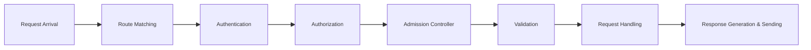

# Kubernetes API

![[Kubernetes API Architecture3.png]]

## Key Interactions with the Kubernetes API

1. **Users & Tools**: Users interact via `kubectl`, Helm, and client libraries.
2. **Monitoring**: Tools query the API to track cluster health.
3. **Internal Components in Kubernetes**:
   - **Kube-scheduler**: Uses the API to schedule Pods on Nodes.
   - **Kubelet**: Reports Node and Pod statuses and receives instructions.
   - **Controller Manager**: Maintains the cluster’s desired state.
   - **Admission Controller**: Kube API can use admission controller to enforces policies (e.g., quotas, validation) and modify resources.
   - set quotas, set defaults, validate configurations, and perform other tasks.
   - useful to set namespace to not exceed a given threshold of memory
   - can accept or reject requests accordingly.

## API Request Processing Flow



1. **Request Arrival**: API receives HTTPS requests (typically on port `6443`).
2. **Route Matching**: API server determines request type (GET, POST, PUT, DELETE, etc.).
3. **Authentication**: Verifies identity via API keys or tokens to validate the requests.
4. **Authorization**: Checks permissions based on RBAC, Webhooks, etc. Are these permissions allowed (relates to the `--authorization-mode api-server` parameter). If the parameter is not set, it will default to `AlwaysAllow` - **allow all requests without any restrictions**.
5. **Admission Controller**: Applies policies (e.g., resource limits).
   1. Enforce policies and validate requests before they are accepted by the API server.
   2. In this case, enforcing a policy that a certain namespace doesn't exceed a given memory threshold is a potential use case for an Admission Controller. This would involve writing a custom admission controller that checks the total memory usage of all pods in a namespace against a predefined limit.
6. **Validation**: Ensures request data is well-formed.
7. **Request Handling**: Executes the operation (e.g., persisting data in `etcd`).
8. **Response Generation & Sending**: Returns HTTP status and response body.

The path of API routing is

1. Authentication: Such as an API key and token
2. Authorization: Are these parameters allowed
3. Admission Controller

## Extending the API with CRDs

- **Custom Resource Definitions (CRDs)** allow defining new resource types.
- E.g., CRD could be used in Kubernetes to deploy and manage MySQL instances.
- Example: A company offering "Database as a Service" can create a CRD to manage databases similarly to built-in resources.

## Exploring the Kubernetes API with `kubectl`

![[kubectl-verbosity.png]]

Using `kubectl`, every request made interacts with the **Kubernetes API**, making it a convenient wrapper. For example, running `kubectl get nodes` retrieves node information, and increasing verbosity (`--v=6`) reveals the actual API request.

In this example, the request is being sent to `https://127.0.0.1:6443`. When the request is made, it is perfoming the authentication using the information in `/root/.kube/config`

### Understanding API Requests

- `kubectl` requests are sent to the **API server** (default: `https://127.0.0.1:6443/api/v1/nodes?limit=500`).
- Authentication is managed via the **kubeconfig** file.
- Directly querying the API without authentication fails.

### Proxying the API

![[kubectl-proxying request.png]]

- Running `kubectl proxy` allows local access over **HTTP** (`http://localhost:8001`) without additional authentication.
- **Proxy handles authentication with the API server** by using existing authentication configuration (e.g., `kubeconfig` or service account tokens).

### Using OpenAPI Specification

- The **OpenAPI specification (formerly Swagger)** provides structured documentation for the Kubernetes API.
- It details available endpoints, expected parameters, authentication, and response formats.
- OpenAPI specs can be retrieved via `kubectl proxy` or found in the **Kubernetes GitHub repo**
- `curl localhost:8001/openapi/v2` or `curl localhost:8001/openapi/v3`
- `https://kubernetes.io/docs/reference/generated/kubernetes-api/v1.25/`
- `https://github.com/kubernetes/kubernetes/blob/release-1.25/api/openapi-spec/swagger.json`

#### Postman for API Exploration

- **Postman** helps visualize and test API interactions.
- Import the **Swagger JSON URL** to generate API requests.
- Set `BASE_URL` to `http://localhost:8001` for API calls through `kubectl proxy`.
- Modify authentication settings (`No Auth`) and headers (e.g., `Content-Type: application/json`).
- Convert API calls into `curl`, `Python`, or `Go` requests.
- Equivalent API request to get nodes

```bash
curl --location 'http://localhost:8001/api/v1/nodes' --header 'Accept: application/json'
```

#### Using `kubectl` to Generate API Payloads

- Running `kubectl run nginx --image=nginx -v9` reveals:
  - The **JSON request body** used to create a Pod.
  - The **POST request** structure and required headers.
- Copy this JSON into **Postman** to quickly recreate API calls.

##### Performing API Operations

- **Creating a Pod**: Use `POST /api/v1/namespaces/default/pods` with a valid JSON body.
- **Deleting a Pod**: Use `DELETE /api/v1/namespaces/default/pods/{pod_name}`.

### Key Takeaways

- **kubectl is a wrapper** for the Kubernetes API.
- **kubectl proxy** enables API access without authentication.
- This is possible because kubectl proxy command in Kubernetes automatically handles authentication with the API server by using the existing authentication configuration, such as the `kubeconfig` file or service account tokens.
- This allows users to access the API server without having to manually authenticate each time.
- **Postman + OpenAPI** simplifies API exploration.
- **Use `kubectl -v9`** to extract API request details and craft direct API calls.
- ”**Rule #7:** Deprecated behaviors must function for no less than 1 year after their announced deprecation.”
- [https://kubernetes.io/docs/reference/using-api/deprecation-policy/#deprecating-a-feature-or-behavior](https://kubernetes.io/docs/reference/using-api/deprecation-policy/#deprecating-a-feature-or-behavior)

## Role-Based Access Control (RBAC) in Kubernetes

- RBAC is a method for managing access to Kubernetes resources, ensuring only authorized users and services can perform specific actions.
- By defining roles and assigning them to users or groups, RBAC enables fine-grained access control and helps prevent unauthorized access to sensitive resources.

### Kubeconfig and CA

- The `kubeconfig` file contains both **cluster details**, such as the API server URL, **certificate authority data, authentication credentials, and user information**, including the username, client certificate, and private key.
- This allows users to authenticate with multiple clusters and switch between them seamlessly.
- **Certificate Authority (CA)** is responsible for **creating and verifying certificates within the cluster**.
- The CA issues certificates to components (pods, services, and nodes), allowing them to securely communicate with each other.
- The CA also verifies the identity of these components by checking their certificates.
- **Users and Groups** in Kubernetes are typically **managed externally** through mechanisms such as **client certificates signed by a Certificate Authority (CA) or tokens** that can be obtained from an external source.
- These external sources **provide the credentials to authenticate users and authorize access to cluster resources**.

### ClusterRole and ClusterRolebinding

- **ClusterRole** defines a **set of permissions that can be applied to resources across the entire cluster**, rather than being limited to a specific namespace. This allows for more flexible and powerful role-based access control (RBAC) configurations.
- **Permissions** are **assigned to users through their membership in a group or by being explicitly mentioned in a RoleBinding or ClusterRoleBinding**.
- A **ClusterRoleBinding grants the permissions** defined in a **ClusterRole to a user or group for all namespaces in the cluster**.
- When a new user, such as "batman", is associated with a group in Kubernetes RBAC, it is done through the "O" field in the certificate subject. The "O" field specifies the organization or group that the user belongs to. This information is used by the Kubernetes API server to determine the user's group membership.

### Understanding Kubernetes Access

![[Kubernetes Deep Dive config view.png]]

- Access to a Kubernetes cluster is typically managed via a **kubeconfig** file, which specifies authentication details.
- The `kubectl config view` command shows the current configuration, including cluster details, users, and certificates.
- `context` entry references a single cluster and user also named **default**.
- when the cluster was created, a CA was set up. There is an entry for the CA in base64
- `cluster` entry has a reference to the API server and port.
- A **Certificate Authority (CA)** ensures secure communication with the API server, preventing man-in-the-middle attacks.
- kubeconfig file reference the public key of the CA.

#### User Authentication and RBAC

![[Kubernetes Deep Dive CA authentication.png]]

- Kubernetes does not manage users directly but relies on certificates issued by a CA to prevent man-in-the-middle attacks.
- This data is encoded in base64
- We can see the certificate from the certificate-authority-data
- ![[Kubernetes Deep Dive decode certificate.png]]
- Users and groups are identified by **Common Name (CN)** and **Organization (O)** fields in certificates.
- Example: A user "James" in the "whales" group would need a certificate signed with `CN=James, O=whales`.
- In users we find client certificate data (user data that has been signed by the CA) and client key data (user's private key).
  - ![[Kubernetes Deep Dive users data.png]]
  - The client-key-data is sensitive and it is used to sign requests make via kubectl to the API server. This is the gateway to the kubernetes cluster.
  - ![[Kubernetes Deep Dive client private key decode.png]]
  - The client-certificate-data show certificates data.
  - ![[Kubernetes Deep Dive client certificates data.png]]
  - ![[Kubernetes Deep Dive client certificates data decoded.png]]
  - We can see that the public key was issued by kubernetes CA
  - `O = system:masters` is the group where the username is assigned.
  - `CN=system:admin` references to the username.
- In kubernetes, we don't create users or groups. We have certificates that relates users to the groups, and then we permission those users and groups with RBAC.
- ![[Kubernetes Deep Dive rbac certificates.png]]

#### Authentication vs Kubeconfig

Even when Kubernetes authenticates users via external certificates, the **kubeconfig** file is still essential because it serves as a configuration file that stores authentication and cluster access details.

1. **Client Configuration**: The `kubeconfig` file contains the information needed for `kubectl` or any Kubernetes client to connect to the cluster, including:
   - The API server endpoint (`server`).
   - The authentication method (`certificate-authority`, `client-certificate`, `client-key`, `token`, or an external authentication provider).
   - The cluster name and context.
2. **Certificate Storage and Reference**: Even if Kubernetes is using an external Certificate Authority (CA) to authenticate users, the `kubeconfig` file typically the certificates (or other credentials like bearer tokens) to authenticate requests.
3. **Multi-Cluster and Multi-User Management**: A `kubeconfig` file can store multiple clusters and user credentials, allowing users to switch between different environments (e.g., development, testing, production) easily.
4. **Delegating Authentication to External Providers**: If Kubernetes uses an **OIDC provider, LDAP, or another external system**, the `kubeconfig` may contain a token or instructions for retrieving credentials dynamically.
5. **Context Switching**: The `kubeconfig` file allows users to manage multiple Kubernetes environments efficiently by defining different contexts.

### RBAC Components

- **Users**: External identities interacting with Kubernetes. Users are not managed by Kubernetes.
- **Groups**: Collections of users with shared permissions. They are manage outside the Kubernetes. When permissions are given to a group, all users that are part of that group receives those permissions.
- **ServiceAccounts**: Managed by Kubernetes, used by applications inside the cluster. They are tied to a namespace and permissions are scoped to the namespaces.
- ServiceAccounts are used to give permissions to the pod to interact with Kube API.

RBAC permissions are defined via **RoleBindings** and **ClusterRoleBindings**, granting users, groups, or service accounts access to specific resources.

![[Kubernetes Deep Dive clusterrolebinding.png]]

- **Users in a group inherit that group’s permissions**.

  - Example: The user `system:admin` belongs to `system:masters`, which is bound to the **cluster-admin** role, granting full cluster-wide access.
    - All users that are part of `system:masters` group receives the same permission.
    - The user does not need to be listed on the clusterrolebinding output
      - It is referenced in the signed CA certificate as a Common Name (CN). In this case, `CN: system:admin`
    - The clusterrolebinding of `cluster-admin` binds:
      - clusterrole `cluster-admin`
      - Group `system:masters`

- **Viewing Permissions**

  - Run `kubectl api-resources --sort-by=name -o wide | more` to list resources and available verbs.
    - Example: `nodes` is a non-namespaced resource with specific verbs assigned.

- **ClusterRole vs. ClusterRoleBinding**
  ![[Kubernetes Deep Dive clusterrole clusterrolebinding connection.png]]
  - A **ClusterRole** is **non-namespaced** and applies to all resources across all namespaces.
    - The **cluster-admin** role grants full permissions to the full cluster (`*` on all resources and verbs).
  - A **ClusterRoleBinding** links a ClusterRole to users, groups, or service accounts.
- **Example: Creating a New Superuser Group**

  - A new **ClusterRole** called `cluster-superhero` is created with full permissions.
    - `kubectl create clusterrole cluster-superhero --verb='*' --resource='*'`
  - A **ClusterRoleBinding** associates this role with the **cluster-superheroes** group.

    ```bash
    kubectl create clusterrolebinding cluster-superhero --clusterrole=cluster-superhero --group=cluster-superheroes
    kubectl auth can-i '*' '*'
    ```

  - Users (e.g., `Batman`, `Superman`, `Wonder Woman`) within this group automatically inherit the permissions.

- **Validating Permissions with `kubectl auth can-i`**

  - The `kubectl auth can-i` command checks if a user, group, or service account has specific permissions.
  - Running `kubectl auth can-i '*' '*'` confirms superuser access for any member of the `cluster-superheroes` group.

    ```bash
    kubectl auth can-i '*' '*' --as-group="cluster-superheroes" --as="batman"
    kubectl auth can-i '*' '*' --as-group="cluster-superheroes" --as="superman"
    kubectl auth can-i '*' '*' --as-group="cluster-superheroes" --as="wonder-woman"
    ```

### Setup Kubernetes authentication and authorization using RBAC

![[Kubernetes Deep Dive certificates generation path.png]]

- **User & Key Creation**:

  - Created an RSA private key (`Batman.key`).
    - `openssl genrsa -out batman.key 4096`
  - Generated a Certificate Signing Request (`Batman.csr`) with `CN=Batman` and `O=cluster-superheroes`.

  ```bash
  openssl req -new -key batman.key -out batman.csr -subj "/CN=batman/O=cluster-superheroes" -sha256
  ```

  - `O` specifies the organization or the group the user belongs to.

    - Submitted the CSR to Kubernetes, got it approved, and extracted the signed certificate (`Batman.crt`).

      ```bash
      CSR_DATA=$(base64 batman.csr | tr -d '\n')
      CSR_USER=batman
      ```

  - Let's create a template for a Kubernetes certificate signing request

```bash
  cat << EOF > batman-csr-request.yaml
  apiVersion: certificates.k8s.io/v1
  metadata:
 name: ${CSR_USER}
  spec:
 request: ${CSR_DATA}
 signerName: kubernetes.io/kube-apiserver-client
 usages:
 - client auth
  EOF
```

- Apply and approve this certificate

```bash
kubectl apply -f batman-csr-request.yaml
kubectl certificate approve batman
```

- We can see the data under status
- ![[Kubernetes Deep Dive certificates status.png]]
- We can decode the certificate which base64, and then we see the real certificate.
- ![[Kubernetes Deep Dive certificate.png]]
- We can decode the certificate, and see that the certificate is approved with our CN of batman
- `openssl x509 -in batman.crt -text -noout`
- ![[Kubernetes Deep Dive decoded certificate.png]]

- **Kubeconfig Setup**:

  - Created a new kubeconfig file (`Batman-Cluster-Superheroes.config`).
    `cp /root/.kube/config batman-cluster-superheroes.config`
  - Removed unnecessary configurations.

    ```bash
    KUBECONFIG=batman-cluster-superheroes.config
    kubectl config delete-context default
    kubectl unset current-context
    ```

  - Added Batman’s credentials and embedded the certificate and key.

    ```bash
    KUBECONFIG=batman-cluster-superheroes.config
    kubectl config set-credentials batman --client-certificate=batman.crt --client-key=batman.key --embed-cert=true
    kubectl config set-context default --cluster=default --user=batman
    kubectl config use-context default
    ```

  - Verified access by running `kubectl get nodes` and deploying a pod.

- **Automated User Management**:
  - Used a script to automate the process for new users (e.g., Superman, Wonder Woman).
    - <https://github.com/spurin/kubeconfig-creator>
    - `./kubeconfig_creator.sh -u superman -g cluster-superheroes`
  - Ensured these users could access the cluster using their kubeconfig files.
- **RBAC (Role-Based Access Control)**:
  ![[Kubernetes Deep Dive role vs cluster-role.png]]

  - **Read-Only User (Uatu)**: Created a `cluster-watcher` role with `list`, `get`, and `watch` permissions.

    ```bash
    kubectl create clusterrole cluster-watcher --verb=list,get,watch --resource='*'
    kubectl create clusterrolebinding cluster-watcher --clusterrole=cluster-watcher --group=cluster-watchers
    kubectl auth can-i 'list' '*' --as-group="cluster-watchers" --as="uatu"
    ```

  - **Pod Manager (Deadpool)**: Created a `pod-manager` role allowing only `list`, `get`, `create`, and `delete` actions on pods.

    ```bash
    kubectl create clusterrole cluster-pod-manager --verb=list,get,create,delete --resource='pods'
    kubectl create clusterrolebinding cluster-pod-manager --clusterrole=cluster-pod-manager --user=deadpool
    kubectl auth can-i 'list' 'pods ' --as-group="cluster-pod-managers" --as="deadpool"
    ```

  - **Namespace-Scoped Role (Gryffindor)**: Created a role with permissions limited to the `Gryffindor` namespace.

    ```bash
    kubectl -n gryffindor create role gryffindor-admin --verb='*' --resource='*'
    kubectl -n gryffindor create rolebinding gryffindor-admin --role=gryffindor-admin --group=gryffindor-admins
    kubectl -n gryffindor auth can-i '*' '*' --as-group="gryffindor-admins" --as=harry
    ```

## Scheduling process

The **kube-scheduler** is responsible for assigning pods to nodes in a Kubernetes cluster. The scheduling process consists of several key steps:

1. **Pod Creation**
   - If a pod is created without a specified node, the `kube-scheduler` determines the best node for it.
     - It evaluates the pod's resource requirements (CPU, memory) against available nodes.
   - Other factors such as **node affinity, anti-affinity, taints and tolerations** are also considered.
2. **Pod Placement**
   - After selecting a suitable node, the scheduler assigns the pod to that node.
   - The **kubelet** on the node then starts the pod.
3. **Scheduling Process**  
   The scheduler follows three main operations:
   - **Filtering:** Nodes that don't meet resource or constraint requirements are removed.
   - **Scoring:** The remaining nodes are scored based on various functions to determine the best fit. The nodes with the highest score is chosen.
   - **Binding:** The pod is assigned to the chosen node, and the kubelet starts the pod. The name of the node is stored in the node name field of the pod.

### Custom Scheduler

   - Kubernetes allows running a custom scheduler by specifying the `schedulerName` field in the pod spec.

     ```yaml
     apiVersion: v1
     kind: Pod
     metadata:
     creationTimestamp: null
     labels:
      run: nginx
     name: nginx
     spec:
      schedulerName: my-scheduler
      containers:
        - image: nginx
      name: nginx
      resources: {}
      dnsPolicy: ClusterFirst
      restartPolicy: Always
      status: {}

     ```

   - A simple example using a Bash script demonstrates a basic custom scheduler that:
   - `git clone https://github.com/spurin/simple-kubernetes-scheduler-example`
     - Queries available nodes.
     - Filters pods scheduled with a custom scheduler.
     - Randomly selects a node and binds the pod.

### Bypassing the Scheduler

   - Instead of using a scheduler, a pod can be assigned directly to a node by setting `nodeName` in the pod spec.
   - `nodeName` specifies the desired node for scheduling, but it may not reflect the actual node the pod is running.
   - In this example, the pod is assigned to the node `worker-2`.

   ```yaml
   apiVersion: v1
   kind: Pod
   metadata:
   creationTimestamp: null
   labels:
    run: nginx
   name: nginx
   spec:
    nodeName: worker-2
    containers:
      - image: nginx
    name: nginx
    resources: {}
    dnsPolicy: ClusterFirst
    restartPolicy: Always
    status: {}
   ```

   Alternatively, it can be created a bind object that binds a pod to an object, and send a post request to the binding api.

  ```yaml
  apiVersion: v1
  kind: Binding
  metadata:
    name: nginx
  target:
    apiVersion: v1
    kind: Node
    name: worker-2
  ```

  ```bash
  curl --header "Content-Type:application/json" --request '{"apiVersion": "v1", "kind": "Binding", ...}' POST --data http://$SERVER/api/v1/namespaces/default/pods/$PODNAME/binding/
  ```


### Labels and Selectors

- A more targeted approach than `nodeName` is `NodeSelectors`.
  - Instead of specifying a direct node, `NodeSelectors` use Kubernetes labels to identify the target node.
  - Selectors filters the items by the label.
    - We can group by the type, or by the application, or by the functionality.
  - This allows for more flexibility and dynamic scheduling based on node characteristics.
- To view available node labels, use the following command:

```bash
kubectl describe node/worker-1 | more

Name:               worker-1
Roles:              <none>
Labels:             beta.kubernetes.io/arch=arm64
                    beta.kubernetes.io/instance-type=k3s
                    beta.kubernetes.io/os=linux
                    kubernetes.io/arch=arm64
                    kubernetes.io/hostname=worker-1
                    kubernetes.io/os=linux
                    node.kubernetes.io/instance-type=k3s
```

- You can use the `nodeSelector` option to select specific nodes through the use of labels.

```yaml
apiVersion: v1
kind: Pod
metadata:
  creationTimestamp: null
  labels:
    app: App1
    function: backend
    run: nginx
  name: nginx
spec:
  nodeSelector:
    kubernetes.io/hostname: worker-1
  containers:
  - image: nginx
    name: nginx
    resources: {}
  dnsPolicy: ClusterFirst
  restartPolicy: Always
status: {}
```
```bash
kubectl get pods --selector app=App1
```

To create a ReplicaSet with 3 different pods, you label the pod definitions and use a selector in the ReplicaSet to group them. In the ReplicaSet definition file, labels appear in two places:

- The labels at the top define labels for the ReplicaSet.
- The labels under the template section define labels for the pods themselves.

```yaml
apiVersion: v1
kind: ReplicaSet
metadata:
  name: single-webapp
  labels:
    app: App1
    function: Front-end
spec:
  replicas: 3
  selector:
    matchLabels:
      app: App1
  template:
    metadata:
      labels:
        app: App1
        function: Front-end
    spec:
      containers:
      - name: simple-webapp
        image: nginx
```

The labels on the ReplicaSet are not immediately important for connecting the ReplicaSet to the pods. The key part is using the selector field in the ReplicaSet specification, which matches the labels on the pods.
A single label can suffice if it uniquely identifies the pods, but if there might be other pods with the same label serving different purposes, you can specify multiple labels to ensure the correct pods are selected by the ReplicaSet.
On creation, if the labels of the selector matches the label of the pods, the ReplicaSet is created successfully.

### Taints and Tolerations

- Taints and Tolerations in Kubernetes control which pods can be scheduled on specific nodes.
  - Taints are set on nodes.
  - Tolerations are set on pods.
- Imagine a cluster with 3 nodes (Node1, Node2, Node3) and 4 pods (A, B, C, D).
  - By default, the scheduler distributes pods evenly across nodes.
  - If you want Node1 to be reserved for specific pods (e.g., for a special application):
    - Add a taint (e.g., blue) to Node1.
      - This prevents all pods from being scheduled on it unless they can tolerate the taint.
  - How the scheduler works in this example:
      - Pod A → Tries Node1 → Rejected due to taint → Placed on Node2
      - Pod B → Tries Node1 → Rejected → Placed on Node3
      - Pod C → Tries Node1 → Rejected → Placed on Node2
      - Pod D → Tries Node1 → Accepted (has toleration for the taint) → Successfully scheduled on Node1
  - Taints and tolerations does not tell the POD to go to only a particular Node. Instead it tells the Node to only accept PODs with certain tolerations.
    - If your requirement is to restrict a POD to certain nodes, it is achieved through another concept called as Node Affinity

Pods have no tolerations by default, so they will not be placed on Node1 anymore.

To allow specific pods (e.g., Pod D) to run on Node1, add a toleration for the blue taint in Pod D’s definition.

```bash
kubectl taint nodes node-name key=value:taint-effect
```

- The taint effects tell what do happens to PODs that do not tolerate the taint.
  - NoSchedule
  - PreferNoSchedule: try to avoid to place the pod on the node, but there is no guarantee.
  - NoExecute: New pods won´t be scheduled on the node, and existing pods on the node will be evicted if they do not tolerate the taint. These pods were scheduled on the node, before they were applied.


```bash
kubectl taint nodes worker-1 app=blue:NoSchedule
```

```yaml
apiVersion: v1
kind: Pod
metadata:
  name: myapp-pod
spec:
  containers:
  - name: nginx-container
    image: nginx
  tolerations:
  - key: "app"
    operator: "Equal"
    value: "blue"
    effect: "NoSchedule"
```


## Storage

<https://kubernetes.io/docs/concepts/storage/volumes/#emptydir>

1. **Ephemeral Storage:**

   - **Does not persist** across restarts.
     - Example: `emptyDir`, used for temporary storage or fast caching.
     - **emptyDir** is a volume created when a Pod is assigned to a node. It's initially empty, and all containers in the Pod can access and modify the files in it, even if mounted at different paths.
     - **Data loss**: When the Pod is removed, the data in the emptyDir is deleted. However, **container crashes do not affect the data**.
   - **Use cases**:
     - Scratch space (e.g., disk-based merge sort).
     - Checkpointing for crash recovery.
     - Holding temporary files for content management.
   - **Storage options**:
     - By default, stored on the node's medium (disk, SSD, or network storage).
     - If `emptyDir.medium` is set to "Memory", it uses a **tmpfs (RAM-backed filesystem)**, which is a high-performed cache area.
     - A **size limit** can be specified for storage, and it will be limited by the node's ephemeral storage. If no size is specified, memory-backed volumes use the node's allocatable memory.
   - Demonstrates an `emptyDir` volume backed by **memory**, showcasing its speed with a performance test using `dd`.

2. **Persistent Storage:**
   <https://kubernetes.io/docs/concepts/storage/persistent-volumes/>
   <https://kubernetes.io/docs/concepts/storage/dynamic-provisioning/>

   - **Persists** even after a pod is removed.
   - Discusses **Storage Classes, Persistent Volumes (PV), and Persistent Volume Claims (PVC)**.
     - When provisioning storage, there are 3 aspects to take into account
       - **Storage classes:** defines the type and characteristics of storage provided by the cluster. It allows administrators to describe the "classes" of storage they offer.
       - **Persistent Volumes:** represents a piece of storage in the cluster that has been provisioned by the administrator or dynamically using a StorageClass.
       - **Persistent Volume Claims:** A **request for storage by the user**. It specifies the amount and characteristics of storage needed by a pod.
       - Once bound to a PV, the PVC can be used to access the storage.
         - PVC are namespaced objects.
   - Manual vs. dynamic provisioning:
     - **Manual**: We create a PV and PVC is created explicitly.
     - **Dynamic**: We create a PVC against a StorageClass. This will create a PV automatically.
     - Volumes are created automatically when PVC is created.
     - These approaches have unique characteristics in Reclaim Policies.
       - **Delete**: The volume will be deleted on the release from its claim
       - **Retain**: The volume will be left in its current phase. This is the default policy.
       - **Recycle**: The files are deleted and the persistent volume is reused. Deprecated since Kubernetes 1.9 in favor of external storage solutions that handle cleanup process.
   - Ceph is a Kubernetes storage for Openshift
     - Ceph is a highly scalable and flexible storage solution that provides comprehensive storage capabilities, including block, file, and object storage, in distributed systems.
     - It uses a decentralized architecture to store data across multiple nodes, making it highly fault-tolerant and reliable.
     - [ceph](https://www.redhat.com/en/technologies/storage/ceph)
     - [ceph example](https://docs.openshift.com/container-platform/3.11/install_config/storage_examples/ceph_example.html)

## StatefulSets

- **StatefulSets** are workload API objects that are used for managing stateful applications, differing from deployments and replica sets, which are typically for stateless workloads.
- StatefulSets are ideal for applications like **databases, caches, or other services requiring state persistence and stable identities across pod restarts and updates.**

### Key Points

- **Deployments and ReplicaSets** are stateless. In deployments, all pods share the same persistent volume (if any) and can be replaced during rolling updates (set a new pod, and do the handover), meaning there is no stable identity or storage for each pod.
- Each ReplicaSet has its own id
- The pod names are randomised
- Deployments can have a PV, but it will be shared by all pods
- **StatefulSets** maintain **stable, unique identities** for each pod, including consistent network names and persistent storage for each instance (Pod).
- Each pod maintains the same identity for each pod in the statefulset
- StatefulSets provide a **sticky identity for each pod**, which means that each pod has a unique and persistent identity that is maintained even if the pod is restarted or rescheduled. This is particularly useful for stateful applications where the identity of the pod is important.
- StatefulSets provide stable **network IDs** for each pod, which means that each pod in a StatefulSet has a **predictable DNS name and hostname**. This allows for stable communication between pods in the same StatefulSet, even if they are rescheduled or recreated.
- SatefulSet pods are named **sequentially, starting from zero and prefixed with the StatefulSet name.** E.g., for "my-statefulset", the pod names would be "my-statefulset-0", "my-statefulset-1", etc...
- Each pod in a StatefulSet has a **Persistent Volume Claim (PVC)** that corresponds to a unique **Persistent Volume (PV)**, ensuring each pod has its own dedicated storage.
- This allows each pod to have its own persistent storage that is decoupled from the pod's lifecycle, ensuring that **data is preserved even if the pod is deleted or recreated**.
- Use cases for StatefulSets:
  - Applications requiring **stable, unique network identifiers**
  - Applications needing **stable, persistent storage**
  - Applications requiring **ordered deployments** and **graceful scaling**
  - Automated rolling updates with stateful guarantees
- The **serviceName** in a StatefulSet's configuration is used to define a headless service for network identity.
- A headless service is a special type of service that doesn't have an IP address or port associated with it. Instead, it provides a way to access the pods in the StatefulSet using DNS. By defining a serviceName, you can create a stable network identity for the StatefulSet, which allows other components in your application to communicate with it reliably.

#### Steps to Use StatefulSets

1. **Creating a StatefulSet**:
   - You can start with a **deployment YAML** and modify it to create a StatefulSet.
   - Ensure a **service name** is added (optional but recommended for stable network IDs).
   - Change the `kind` to `StatefulSet` in the YAML.
2. **Network Identity**:
   - Each pod in the StatefulSet gets a name based on the StatefulSet name (e.g., `nginx-0`, `nginx-1`, etc.).
   - For stable networking, use a **headless service** (with `clusterIP: None`), which allows pods to have DNS names like `nginx-0.nginx.default.svc.cluster.local`.
3. **Rolling Updates**:
   - The StatefulSet supports **ordered** updates. Pods are updated one by one in a controlled sequence.
   - The `partition` field can be set to **control which pods are updated during a rolling update**. E.g., setting `partition: 2` ensures that pods `nginx-0` and `nginx-1` remain unchanged while `nginx-2` is updated.
     - The `partition` value indicates the starting point for a rolling update, specifying which pods should be updated first. By setting the partition value to a specific number, you can control which subset of pods are updated initially, allowing for more fine-grained control over the rollout process.
4. **Persistent Storage**:
   - Each pod in a StatefulSet can have its own persistent storage, with dynamic provisioning.
   - If the StatefulSet is deleted, the **PVC** and **PV** remain, allowing the StatefulSet to **reuse the same storage** when it is recreated, preserving data between pod restarts.
5. **Example**:
   - Create a StatefulSet YAML from a deployment template, adding a service name and changing `kind` to `StatefulSet`.
   - After deploying the StatefulSet, you can see that each pod is named `nginx-0`, `nginx-1`, etc., and each has its own persistent volume claim.
   - Even after pod deletion and recreation, the data persists in the associated volume.

### Key Features of StatefulSets

- **Stable Identity**: Pods are named sequentially (e.g., `nginx-0`, `nginx-1`).
- **Persistent Storage**: Each pod can claim its own persistent storage (PV/PVC).
- **Ordered Deployments and Updates**: Pods are managed and updated in a specified order.
- **Headless Service**: Needed for stable network identities.

## Network Policies

- Helps to **isolate pods from each other and control their communication.**
- We can restrict access to pods, namespaces, and IP blocks using network traffic rules that allow or deny communication based on labels, ports, and other criteria.
- An 'Ingress' rule defines the types of traffic permitted to enter pods from external sources or other pods.
-  NetworkPolicy in Kubernetes becomes **effective after it is applied**. When a NetworkPolicy is created and applied to a cluster, it **defines the rules for traffic flow between pods and services**. The policy takes effect immediately after it is successfully applied, allowing or blocking traffic according to its specifications.
- When a pod is created using `kubectl run` in Kubernetes, a label with key `run` and `value` is automatically assigned to it
- `key` is `run`
- `value` is the name of the deployment or replica set that manages the pod.

```bash
kubectl describe pod/curl | more
Name:             curl
Namespace:        default
Priority:         0
Service Account:  default
Node:             worker-1/172.18.0.4
Start Time:       Sun, 16 Feb 2025 21:41:02 +0000
Labels:           run=curl
```

### Container Network Interface (CNI)

- CNI plugin is essential for the enforcement of NetworkPolicies in Kubernetes.
- CNI plugins are responsible for **configuring and managing the network interfaces of containers**, which includes enforcing NetworkPolicies.
- When a NetworkPolicy is created, the CNI plugin is responsible for **implementing the policy by configuring the necessary network rules to allow or deny traffic**.
- When **multiple NetworkPolicies** are applied to a set of pods in Kubernetes, their **effects are additive and cumulative**. This means that each policy builds upon the previous ones, creating a more complex set of rules that govern network traffic to and from the pods. The resulting policy is the combination of all the individual policies.
- By **default**, a pod in a Kubernetes cluster without any NetworkPolicies applied to it **can send and receive traffic from any source**. This means that there are no restrictions on incoming or outgoing traffic, allowing the pod to freely communicate with other pods, services, and external networks.

## Pod Disruption Budgets

- PDB vs Replicas
- Replicas **ensure that a specified number of replicas** (i.e., copies) of a pod are **running** at any given time, which helps **maintain availability under normal operations**.
- **PDBs protect against disruptions** by **specifying the maximum number of pods that can be terminated** within a certain time period, ensuring that a **minimum number of replicas remain available even during disruptions**.
- PDBs ensure **high availability** of applications during **voluntary disruptions**, such as maintenance or node autoscaling. Unlike replicas, which maintain availability under normal conditions, PDBs prevent excessive disruption during planned operations.
- PDB improves application stability during maintenance by **ensuring that a minimum number of pods remain available when nodes undergo voluntary disruptions**, such as upgrades, autoscaling, or planned maintenance, even when nodes are being drained or maintained.
- **Voluntary disruptions** in Kubernetes refer to **intentional actions taken by administrators**, such as maintenance or upgrades, that may cause pods to be terminated or become unavailable. These disruptions are planned and executed by humans, hence the term "voluntary".
- When you use the `kubectl drain` command on a node, it removes all running pods from that node and marks it as unschedulable to prevent new pods from being scheduled on it. This is typically done before performing maintenance or upgrades on the node.

### Demonstration

1. **Deployment Setup:**
   - A deployment with **five replicas** is created, distributing pods across multiple nodes.
   - Nodes are **cordoned** (marked unschedulable), and pods are deleted.
   - Replicas automatically reschedule on available nodes.
2. **Impact of Draining Nodes:**
   - Running `kubectl drain` on a node removes pods, potentially leaving the deployment at **zero** replicas.
   - In real applications, this could cause downtime and trigger alerts.
3. **Using a Pod Disruption Budget (PDB):**
   - A **PDB is created** to enforce a minimum of **two available pods**.
   - When attempting to drain nodes, Kubernetes **prevents eviction** of critical pods.
   - The operation only proceeds when conditions allow at least two pods to remain active.

## Security

### Security Context

- **Security Contexts**: Kubernetes settings that **define access control and privileges for pods or containers**.
- We modify a pod to run as a non-root user, preventing escalation to root access, improving security for each pod. They allow you to specify the user ID, group ID, and other security-related settings for a container.
- This [image](https://github.com/spurin/rootshell) has a Dockerfile that creates a container image with a custom `rootshell` binary. In this example, we use `runAsUser` and `runAsGroup` to

```bash
% docker run -it --rm --user 1000:1000 spurin/rootshell:latest
nonpriv@00eac4da6562:/$
nonpriv@00eac4da6562:/$ id
uid=1000(nonpriv) gid=1000(nonpriv) groups=1000(nonpriv)
nonpriv@00eac4da6562:/$ /rootshell
root@00eac4da6562:/#
root@00eac4da6562:/# id
uid=0(root) gid=1000(nonpriv) groups=1000(nonpriv)
```

- **runAsUser**: This specifies the user ID (UID) that the container should run as. By setting this, you can ensure that the container runs with a non-root user, even if the container image itself is designed to run as root by default. This is a key measure in preventing privilege escalation.
- **runAsGroup**: Similar to **runAsUser**, **runAsGroup** specifies the group ID (GID) that the container should run as. This ensures that the container’s processes belong to a specific group, further enhancing control over its access and privileges.
- In the demonstration, the **runAsUser** and **runAsGroup** are set to 1000 (the UID and GID of the user defined in the Docker image). By configuring these fields in the pod's security context, the pod is instructed to run with a specific user and group, rather than as root. This is crucial for restricting access and reducing security risks.
- These settings are part of the broader security context configuration, helping administrators enforce **least privilege** access in Kubernetes environments.
- Setting `allowPrivilegeEscalation` to false in the container's security context prevents the escalation of privileges within the container. When this field is set to false, the container cannot gain additional privileges and is restricted to its current user ID. This helps prevent privilege escalation attacks where an attacker gains elevated privileges within a container.

### Admission Controller

- **Admission Controllers**: Since Kubernetes 1.25, **admission controllers replace deprecated pod security policies to enforce security at the cluster level**. They act as **gatekeepers**, preventing actions like root container execution and process escalation, or enforce critical security policies to reduce attack vectors.
- They intercept requests to the API server and can modify or reject them based on custom rules and policies. This allows cluster administrators to enforce specific requirements, such as security checks or resource quotas, before allowing pods to be created or modified.
- Tools like **Kyverno** and **OPA Gatekeeper** provide additional policy enforcement.
- Pod Admission Controllers in Kubernetes are used to enforce policies on incoming pods, such as validating or mutating their configuration before they are created. Kyverno and Open Policy Agent (OPA) Gatekeeper are two popular options that **allow administrators to define custom policies using YAML or Rego**, respectively, which can then be applied to incoming pods.
- **Other Tools**:
- **Falco**: A runtime security tool that **monitors abnormal behavior and security threats**.
- Falco is an open-source runtime security project that integrates with Kubernetes to identify abnormal behavior and potential security threats. It uses a behavioral approach to detect anomalies in system calls, network activity, and other system interactions, providing real-time alerts and notifications for security teams.
- **Kubescape**: A security platform that **scans for vulnerabilities and misconfigurations**. It provides a comprehensive security scan of the cluster, identifying potential vulnerabilities and misconfigurations that could be exploited by attackers.
- **[OIDC (OpenID Connect)](https://medium.com/@extio/kubernetes-authentication-with-oidc-simplifying-identity-management-c56ede8f2dec)**: An authentication protocol based on OAuth 2.0, **recommended for large-scale Kubernetes clusters.**
- OpenID Connect (OIDC) is an i**dentity layer built on top of OAuth 2.0** that provides a **standardized way to authenticate users in large-scale deployments**.
- OIDC provides a scalable and secure authentication mechanism that can be easily integrated with Kubernetes, making it a recommended protocol for enhanced authentication.

### 4Cs

- 4C’s of Cloud Native Security, namely Cloud, Cluster, Container, Code.
- This sequence represents the layers of abstraction in cloud native environments, starting from the broadest scope (cloud providers) to the narrowest scope (application code).
- Each layer builds upon the previous one, and securing each layer is crucial for overall security.
- Each endpoint acts as a layer from the outside-in and is a security best practice in Cloud Native Computing.
- Each subsequent layer acts as a reinforcement for the layer within. For example, Code would benefit from the security implementations of Container, Cluster and Cloud respectively.

## Helm and Helm charts

- Helm simplifies Kubernetes application management using **Helm Charts** (packages with pre-configured Kubernetes resources) by providing a way to easily install, upgrade, and manage applications on a Kubernetes cluster.
- They provide a way to package, distribute, and manage applications, making it easier to deploy and manage complex applications in a Kubernetes environment.
- It uses a templating engine to generate Kubernetes resources from templates, making it easier to manage complex applications.
- Think of Helm as the **APT** or **YUM** of Kubernetes, allowing easier deployment, updates, and management of applications.
- You can package charts for version control and easy distribution.
- Helm enables easier scaling and upgrading of Kubernetes applications in real-world scenarios.

1. **Creating a Helm Chart:**
   - Create a basic chart using: `helm create flappy-app`.
   - Customize:
     - **`Chart.yaml`** → Add name, description, and version (following semantic versioning).
     - **`values.yaml`** → Set the Docker image to `spurin/flappy-doc:latest`. Disable unnecessary service accounts.
2. **Packaging and Deploying:**
   - Package the chart with: `helm package`.
   - Deploy using: `helm install flappy-app ./flappy-app-0.1.0.tgz`
   - Verify deployment with:
     - `kubectl get deployments`
     - `kubectl get pods`
     - `kubectl get services`
   - Use port forwarding to access the game locally via `kubectl port-forward`.
3. **Exploring and Cleaning Up:**

   - List running charts: `helm list`
   - Uninstall: `helm uninstall flappy-app`
   - Remove the project directory for cleanup.

## Service Meshes

Microservices have revolutionized software development by providing efficiency, scalability, and resilience. They consist of small, independently deployable units, making them ideal for diverse deployment environments, including hybrid and multi-cloud setups. However, as microservices grow, managing service-to-service communication becomes complex.

Service meshes are for managing complex microservice architectures in cloud-native environments. They improve security, observability, and reliability. Exploring solutions like **Istio**, **Linkerd**, or experimenting with the **SMI** standard is an excellent next step for deepening your understanding.

### Role of Service Meshes

A **service mesh** simplifies this complexity by ensuring efficient, reliable, and secure communication between microservices, especially as applications scale.

![[Kubernetes Deep Dive Sidecar proxy.png]]
A service mesh consists of:

- **Data Plane**: Manages internal network traffic between services using either:
  - **Sidecar proxies** (e.g., Istio, Linkerd) attached to each microservice for fine-grained traffic control, providing additional functionality such as traffic management and security. This pattern enables the injection of additional capabilities into the data path without modifying the application code.
  - **Host node proxies** (e.g., Traffic Mesh) installed at the node level for simpler management. They route network traffic between external client, nodes, and pods.
- **Control Plane**: Acts as the management layer, configuring and directing proxies across the system. It dictates the policies for traffic routing, security, and monitoring and provides the instructions that the proxies follow when handling requests between services.

### Key Benefits of Service Meshes

- **Security**: **Mutual TLS ensures two-way verification for secure communication**. It ensures that only authorized services can communicate with each other, reducing the risk of unauthorized access or man-in-the-middle attacks.
- **Access Control**: Fine-grained policy management.
- **Observability**: Tracing and monitoring tools provide deep insights.
- **Reliability**: Features like rate limiting and circuit breaking improve system resilience.

### Standardization with SMI (Service Mesh Interface)

Kubernetes supports the **Service Mesh Interface (SMI)**, which **provides a unified API standard for various service mesh solutions**. By defining a set of common APIs, SMI enables users to manage and configure their Service Mesh environments in a consistent manner, regardless of the underlying implementation. It allows developers to:

- Manage traffic, access control, and metrics across different meshes.
- Avoid vendor lock-in with consistent functionalities across implementations.

## Data Plane and Control Plane in a service mesh vs normal kubernetes

### 1️⃣ In a Service Mesh

A **service mesh** introduces a dedicated **control plane** and **data plane** to manage communication between microservices efficiently.

#### 🛠 Control Plane (Management Layer)

- **Manages and configures the data plane proxies** across the mesh.
- Enforces **security policies, routing, observability, and traffic shaping**.
- Examples:
  - **Istio** → **Istiod** (control plane) manages Envoy sidecars.
  - **Linkerd** → **Control plane** manages Linkerd proxies.

#### 🚀 Data Plane (Traffic Handling Layer)

- **Intercepts and processes network traffic** between services.
- Enforces **routing, retries, load balancing, mTLS (mutual TLS), and telemetry**.
- Typically implemented as **sidecar proxies** (e.g., **Envoy**, **Linkerd Proxy**).

🖼 **Example in Istio:**

```yaml
# Istiod (Control Plane)
# Envoy (Data Plane - injected as a sidecar in every Pod)
```

- **Istiod** manages service discovery, security policies, and configuration.
- **Envoy proxies** inside Pods handle all network traffic.

---

### 2️⃣ In a Normal Kubernetes Pod

In a regular **Kubernetes cluster (without a service mesh)**, the **data plane and control plane** have different meanings.

#### **🛠 Control Plane (Kubernetes Cluster Management)**

- **Manages the cluster** (Pods, scheduling, API, etc.).
- Components:
  - **kube-apiserver** → Entry point for all API requests.
  - **kube-controller-manager** → Handles controller loops.
  - **kube-scheduler** → Assigns Pods to nodes.
  - **etcd** → Stores cluster state.

#### 🚀 Data Plane (Workloads Running on Nodes)

- The **data plane consists of worker nodes** running application workloads.
- Components:
  - **kubelet** → Ensures Pods are running.
  - **Container runtime (e.g., CRI-O, containerd, Docker)** → Runs containers.
  - **kube-proxy** → Manages network rules.

🖼 **Example in Kubernetes:**

```yaml
# Control Plane:
# - kube-apiserver
# - etcd
# - kube-controller-manager
# - kube-scheduler
# Data Plane:
# - Worker nodes
# - kubelet
# - Pods (running apps)
# - kube-proxy (handles networking)
```

### 🔍 Key Differences

| Feature           | **Service Mesh**                               | **Normal Kubernetes Pod**                                      |
| ----------------- | ---------------------------------------------- | -------------------------------------------------------------- |
| **Control Plane** | Manages proxies, policies, security            | Manages cluster, scheduling, API                               |
| **Data Plane**    | Proxies network traffic between services       | Runs actual application workloads                              |
| **Example**       | Istio (**Istiod** = control, **Envoy** = data) | Kubernetes (**API server** = control, **Worker nodes** = data) |
| **Purpose**       | Service-to-service communication               | Running containerized applications                             |
