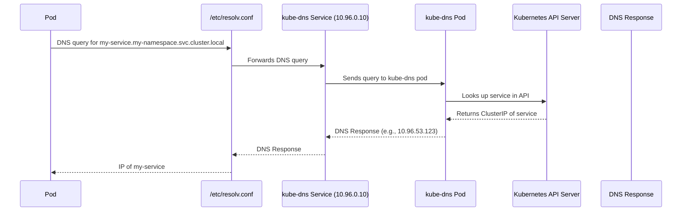

# Container Orchestration

## Cluster Networking

- **Node Configuration:**
  - Each **node** (master or worker) must have:
    - At least **one network interface** (e.g., `eth0`)
    - A **configured IP address**
    - A **unique hostname**
    - A **unique MAC address** (important when cloning VMs)

---

### 🌐 **Network & Ports Overview**

#### **Key Nodes:**

- `master-01`: `192.168.1.10`
- `worker-01`: `192.168.1.11`
- `worker-02`: `192.168.1.12`

#### **Key Ports to Open:**

There are some ports that need to be open, because they are going to be used by the Kubernetes components.

| Component               | Port        | Node Type       | Description                                  |
| ----------------------- | ----------- | --------------- | -------------------------------------------- |
| Kube API Server         | 6443        | Master          | Entry point for all API calls                |
| Kubelet                 | 10250       | Master & Worker | Manages containers on nodes                  |
| Kube Scheduler          | 10251       | Master          | Schedules pods                               |
| Kube Controller Manager | 10252       | Master          | Maintains cluster state                      |
| Services (NodePort)     | 30000–32767 | Workers         | External access to services                  |
| etcd                    | 2379        | Master          | Cluster data store                           |
| etcd                    | 2380        | Master          | To etcd clients communicate with each other. |

If there are multiple master nodes, it is also necessary to open port 2380.

## Pod Networking

**Summary of Kubernetes Pod Networking Setup**

After setting up Kubernetes master and worker nodes with proper networking and control plane components (kube-apiserver, etcd, kubelets, etc.), the focus shifts to Pod networking, a critical layer for cluster functionality. Kubernetes requires a networking solution to address Pod communication, but it does **not provide a built-in solution**. Instead, it defines clear requirements for Pod networking, which must be implemented using a Container Network Interface (CNI) plugin or custom solution.

### Pod Networking Requirements

1. **Unique IP Address**: Every Pod must have its own unique IP address.
2. **Intra-Node Communication**: Pods on the same node must communicate with each other using their IP addresses.
3. **Inter-Node Communication**: Pods on different nodes must communicate without Network Address Translation (NAT).

### Implementation Approach

To meet these requirements, a manual networking setup is described, which helps understand how CNI plugins work. The process is applied to a three-node cluster (Node1: 192.168.1.11, Node2: 192.168.1.12, Node3: 192.168.1.13) connected via a LAN (192.168.1.0/24).

#### Steps for Pod Networking

1. **Create Bridge Networks**:

   - On each node, a bridge network (v-net-0) is created to connect Pods.
   - Each bridge is assigned a unique subnet:
     - Node1: 10.244.1.0/24 (bridge IP: 10.244.1.1)
     - Node2: 10.244.2.0/24 (bridge IP: 10.244.2.1)
     - Node3: 10.244.3.0/24 (bridge IP: 10.244.3.1)
   - Commands:

   ```bash
   ip link add v-net-0 type bridge
   ip link set dev v-net-0 up
   ip addr add <bridge-ip>/24 dev v-net-0
   ```

2. **Connect Pods to Bridge**:

   - For each Pod, Kubernetes creates a network namespace.
   - A virtual Ethernet (veth) pair is created to connect the Pod’s namespace to the bridge:
     - One end (veth-red) is placed in the Pod’s namespace.
     - The other end (veth-red-br) is attached to the bridge.
   - Assign a unique IP from the node’s subnet (e.g., 10.244.1.2 for a Pod on Node1).
   - Commands are scripted (net-script.sh) for automation:

   ```bash
   ip link add veth-red type veth peer name veth-red-br
   ip link set veth-red netns <pod-namespace>
   ip -n <pod-namespace> addr add <pod-ip> dev veth-red
   ip link set veth-red-br master v-net-0
   ip -n <pod-namespace> link set veth-red up
   ip -n <pod-namespace> route add default via <bridge-ip>
   ```

3. **Enable Inter-Node Pod Communication**:

   - Pods on different nodes need routing to communicate.
   - Add routes on each node to direct traffic to other nodes’ subnets via their external IPs:

#### On Node1

```bash
ip route add 10.244.2.0/24 via 192.168.1.12
ip route add 10.244.3.0/24 via 192.168.1.13
```

#### On Node2

```bash
ip route add 10.244.1.0/24 via 192.168.1.11
ip route add 10.244.3.0/24 via 192.168.1.13
```

#### On Node3

```bash
ip route add 10.244.1.0/24 via 192.168.1.11
ip route add 10.244.2.0/24 via 192.168.1.12
```

- Alternatively, configure a router with routes for all subnets (e.g., 10.244.0.0/16) and set it as the default gateway for nodes to simplify management.

4. **Automate with CNI**:

- Manual scripting is impractical for large clusters, so the script is adapted for CNI compatibility.
- The script includes:
  - **ADD**: Creates veth pair, assigns IP, connects to bridge, and sets routes.
  - **DEL**: Removes veth pair and frees IP when a Pod is deleted.
- Kubelet uses CNI configuration (/etc/cni/net.d) and binaries (/etc/cni/bin) to execute the script automatically when Pods are created or deleted:

  ```bash
  ./net-script.sh add <container> <namespace>
  ```

### Outcome

- Pods receive unique IPs (e.g., 10.244.1.2, 10.244.2.2) and can communicate within and across nodes without NAT.
- The setup ensures scalability by scripting repetitive tasks and integrating with CNI for automation.
- While this is a basic solution, production clusters typically use CNI plugins (e.g., Flannel, Calico) that handle these tasks more efficiently.
-

## CNI in Kubernetes

- CNI (Container Network Interface) outlines the responsibilities of the container runtime (e.g., Kubernetes) in networking. According to CNI, the runtime must:
  - Create network namespaces for containers
  - Identify the appropriate network
  - Attach the container to that network by invoking the correct CNI plugin
- As per CNI, container runtimes is responsible for creating container network namespaces, identifying and attaching those namespaces to the right network by calling the right network plugin.

```yaml
ExecStart=/usr/local/bin/kubelet \\
--config=/var/lib/kubelet/kubelet-config.yaml \\
--container-runtime=remote \\
--container-runtime-endpoint=unix:///var/run/containerd/containerd.sock--image-pull-progress-deadline=2m \\
--kubeconfig=/var/lib/kubelet/kubeconfig \\
--network-plugin=cni \\
--cni-bin-dir=/opt/cni/bin \\
--cni-conf-dir=/etc/cni/net.d \\
--register-node=true \\
--v=2
```

- The CNI plugin is invoked by the Kubernetes component that creates containers—typically the kubelet.
  - After creating a container, the kubelet calls the appropriate network plugin to set up networking.
  - CNI configuration is specified in the kubelet service, where the `--network-plugin=cni` option enables CNI support.

```bash
cat /etc/cni/net.d/10-bridge.conf
```

```yaml
{
  "cniVersion": "0.2.0",
  "name": "mynet",
  "type": "bridge",
  "bridge": "cni0",
  "isGateway": true,
  "ipMasq": true,
  "ipam":
    {
      "type": "host-local",
      "subnet": "10.22.0.0/16",
      "routes": [{ "dst": "0.0.0.0/0" }],
    },
}
```

- The bridge CNI config file follows the standard CNI plugin format. It defines a network (mynet) of type bridge, and includes settings related to networking concepts like bridging, routing, and NAT masquerading.
  - isGateway: assigns an IP to the bridge so it can act as a gateway.
  - ipMasq: enables NAT masquerading for outbound traffic.
  - IPAM section: specifies IP address management settings, like the subnet for Pods and routing rules.
  - type: host-local: means IPs are managed locally; it can also be set to dhcp to use an external DHCP server.

## CNI weave

![[CNI Weave Network.png]]

The Weave CNI plugin simplifies networking in large Kubernetes clusters by deploying agents (peers) on each node. These agents:

- Form a network among themselves to share information about pods and IP addresses across the cluster.
- Create a custom bridge (weave) on each node and assign IPs to connected pods.
- Encapsulate packets for inter-node communication: when a pod sends a packet to another pod on a different node, the local Weave agent wraps the packet and sends it to the destination node, where the receiving agent unwraps and delivers it to the correct pod.
- This avoids the complexity of maintaining large routing tables, as agents handle routing internally.

### Example

![[Weave Network Package Delivery.png]]
1. **Package is sent**:  
    Someone in `office-10` sends a package to `office-3`, not knowing the exact path—only the target office name.    
2. **Local agent intercepts**:  
    The **shipping agent** at `office-10` intercepts the package. He checks the destination (`office-3`) and, through his internal network (i.e., communication with other agents), knows exactly which **site and department** it belongs to.
3. **Encapsulation**:  
    The agent **wraps** the original package inside a new one, adding the **destination site’s address** as the outer label—this is similar to network **encapsulation** where the packet is wrapped with new headers.
4. **Sending the package**:  
    The agent sends this newly wrapped package across the **external network** toward the correct destination site.
5. **Reception at destination site**:  
    Once the package reaches the destination site, the **shipping agent** there intercepts it.
6. **Decapsulation**:  
    The receiving agent **opens** (decapsulates) the outer package and retrieves the original one.
7. **Final delivery**:  
    The original package is then delivered to `office-3` (the final target).

### Analogy to Weave CNI:

- The **shipping agents** = Weave peers on each node.
- The **internal network of agents** = Weave's peer-to-peer control plane that keeps track of pod IPs and locations.
- **Encapsulation** = Wrapping the original packet in a new packet with new headers for inter-node communication.
- **Decapsulation** = Extracting the original packet at the receiving node.
- **Delivery to target** = Routing the packet to the correct pod on the destination node.

#### Steps:

- **Peer communication and topology sharing**:  
    Weave agents (peers) on each node constantly communicate and **exchange information** about nodes, networks, and pod IPs. Each peer maintains a **complete topology** of the cluster.
- **Bridge creation and IP assignment**:  
    Weave creates a **custom bridge** on each node called `weave`, and **assigns IP ranges** for pod communication.
- **Pod network attachment**:  
    Pods can be attached to multiple bridges (e.g., Docker’s default bridge and Weave’s bridge).  
    **Routing is configured** to ensure traffic goes through the correct bridge.
- **Routing through Weave**:  
    When a pod sends a packet to another pod on a different node:
    - The local **Weave agent intercepts** the packet.
    - It **detects** that the destination pod is on a different node.
    - The packet is **encapsulated** in a new one with updated source and destination.
    - The encapsulated packet is **sent over the network** to the destination node.
- **Decapsulation and delivery**:
    - The destination node’s **Weave agent receives** the encapsulated packet.
    - It **decapsulates** the packet.
    - Then, it **routes** the original packet to the correct destination pod.

Deployment:

- Weave can be installed as a DaemonSet, ensuring one Weave pod per node. You can deploy it with a single kubectl apply command after your Kubernetes control plane is set up.

Troubleshooting:

- You can inspect Weave pods and view logs using kubectl logs.
- The office analogy explains that Weave acts like a smart internal courier system that automatically knows how to route messages (packets) between offices (pods) across many locations (nodes).

## DNS in Kubernetes



- KubeDNS provides DNS resolution within the cluster.
- It allows **pods to discover other services and pods** using DNS names like:

```pgsql
my-service.my-namespace.svc.cluster.local
<service>.<namespace>.svc.cluster.local
```

- For pods

```pgsql
10-244-2-5.my-namespace.svc.cluster.local
<pod ip>.<namespace>.svc.cluster.local
```

| Feature       | kube-dns         | CoreDNS                         |
| ------------- | ---------------- | ------------------------------- |
| Components    | dnsmasq, kubedns | Single binary (modular)         |
| Performance   | Good             | Better (more efficient)         |
| Extensibility | Limited          | Plugin-based, highly extensible |
| Default since | Older clusters   | Kubernetes 1.11+                |
### Flow of a DNS request from a pod

#### 1. **Application in the Pod makes a DNS query**
- For example, an app tries to reach `my-service`, so it tries to resolve the DNS name using standard `libc` functions (like `getaddrinfo()`).
#### 2. **Pod’s `/etc/resolv.conf` is used**
- Kubernetes injects a custom `/etc/resolv.conf` into the Pod, typically pointing to the **cluster DNS server**, often something like:
```pgsql
nameserver 10.96.0.10
search default.svc.cluster.local svc.cluster.local cluster.local
options ndots:5
```
#### 3. **Query goes to CoreDNS (or kube-dns)**
- The Pod sends the DNS request (UDP or TCP on port 53) to the cluster DNS server (usually **CoreDNS**, running as a Deployment in the `kube-system` namespace).
- The **cluster DNS IP** (e.g., `10.96.0.10`) is usually a **ClusterIP** service that points to the CoreDNS Pods.
#### 4. **Kube-proxy handles the Service routing**
- kube-proxy configures iptables or IPVS to route traffic to the CoreDNS Pods behind the ClusterIP service.
#### 5. **CoreDNS processes the request**
- CoreDNS looks up the service in the Kubernetes API (via its `kubernetes` plugin).
	- For example, if resolving `my-service.default.svc.cluster.local`, it queries the Kubernetes API for the service named `my-service` in the `default` namespace.
- **kube-dns receives the request**
  - `kube-dns` is a **Deployment** with a `kube-dns` **Service** pointing to its pods. It runs:
    - `dnsmasq` (a lightweight DNS server that does caching and forwarding)
    - `kubedns` (a Go program that talks to the Kubernetes API)
      - `sidecar` (for health checks and metrics)
#### 6. **CoreDNS looks up the service**
- `kubedns` queries the **Kubernetes API** to check if `my-service` exists in `my-namespace`
	- If yes, CoreDNS returns the **ClusterIP** of the service

## Ingress

### Deploying on Kubernetes

#### Deploy the application on on-prem datacenter

![[Application-on-Prem.png]]

- You deploy an application for an online store (`my-online-store.com`) using a Docker image inside a **Pod**, managed by a **Deployment**.
- You deploy a **MySQL Pod** and expose it internally using a **ClusterIP service** called `mysql-service`.
- You create a **NodePort service**, which assigns a high-numbered port (e.g., `38080`) on each node. Users can now access the app via `http://<NodeIP>:38080`.
- As traffic grows, you scale the Pods, and the Service handles load-balancing.
- You configure a **DNS** to point `my-online-store.com` to your nodes, but the port (`38080`) is still required.
- To simplify access, you introduce a **proxy server** that listens on port **80** and forwards traffic to port `38080`. DNS is updated to point to this proxy, allowing users to visit the site using just `my-online-store.com`.

#### Deploy the application on GCP

![[Application-on-GCP.png]]

- In a **public cloud environment** like **Google Cloud Platform (GCP)**, instead of using a **NodePort** service, you can expose your application using a **LoadBalancer** service type.
- When you create a LoadBalancer service, Kubernetes still provisions a high port (like with NodePort), but it also **requests GCP to provision a network load balancer**.
- GCP then automatically sets up the load balancer, routing traffic to the appropriate node ports, and provides an **external IP**.
- You can point your **DNS (e.g., `my-online-store.com`)** to this external IP, allowing users to access the application directly without needing to remember port numbers or specific node IPs.

##### Adding another service

- A new **video streaming application** is deployed in the **same Kubernetes cluster** to share resources. It is set up as a separate **Deployment**, and a **LoadBalancer service** (`video-service`) is created for it.
- Kubernetes assigns **port 38282** and requests the cloud provider to create a **new network load balancer**, which comes with a **new external IP**.

##### Emerging problems

- It's important to note that **each LoadBalancer incurs cost**, and using multiple LoadBalancers can **significantly increase your cloud bill**.
- To traffic between load balancers, your need another proxy or load balancer that can re-direct traffic based on URLs to the different services.
- If you need SSL, it can be done at different levels, either at the application level itself, or at the load balancer or proxy server level, but which one?

##### **A Better Solution: Ingress**

- What if all this could be managed **within Kubernetes itself**, using a single entry point?
- You could define routing rules, SSL, and exposure configuration as **Kubernetes manifests**, just like your Deployments and Services.
- That’s exactly what **Ingress** provides—a **centralized, cost-effective, and manageable** way to handle external access, routing, and SSL.

### Ingress

![[Ingress-Deployment.png]]

- Think of ingress as a layer 7 load balancer built-in to the kubernetes cluster that can be configured using native kubernetes primitives just like any other object in kubernetes.
- Even when using **Ingress**, you still need to expose the **Ingress Controller** to the outside world—typically via a **NodePort** or a **Cloud LoadBalancer**.
- Once configured, all future **load balancing**, **authentication**, **SSL**, and **URL-based routing** are handled through the **Ingress Controller** and its associated **Ingress Resources**.
- Without Ingress, you would manually deploy and configure **NGINX** as a **reverse proxy** inside your cluster to handle routing, SSL, etc.
- With ingress, **NGINX** act as an **Ingress Controller**.
	- You define **Ingress Resources** (YAML manifests with routing and SSL rules) as a Deployment.

```yaml
---
apiVersion: v1
kind: Namespace
metadata:
  name: ingress-nginx

---
apiVersion: v1
kind: ConfigMap
metadata:
  name: nginx-config
  namespace: ingress-nginx
  labels:
    app.kubernetes.io/name: ingress-nginx
data:
  proxy-body-size: "4m"
  enable-vts-status: "true"

---
apiVersion: apps/v1
kind: Deployment
metadata:
  name: ingress-nginx-controller
  namespace: ingress-nginx
spec:
  replicas: 1
  selector:
    matchLabels:
      app.kubernetes.io/name: ingress-nginx
      app.kubernetes.io/component: controller
  template:
    metadata:
      labels:
        app.kubernetes.io/name: ingress-nginx
        app.kubernetes.io/component: controller
    spec:
      serviceAccountName: nginx-ingress-serviceaccount
      containers:
        - name: controller
          image: registry.k8s.io/ingress-nginx/controller:v1.9.4
          args:
            - /nginx-ingress-controller
            - --configmap=$(POD_NAMESPACE)/nginx-config
            - --election-id=ingress-controller-leader
            - --ingress-class=nginx
            - --watch-ingress-without-class=true
          env:
            - name: POD_NAMESPACE
              valueFrom:
                fieldRef:
                  fieldPath: metadata.namespace
          ports:
            - name: http
              containerPort: 80
            - name: https
              containerPort: 443
          readinessProbe:
            httpGet:
              path: /healthz
              port: 10254
            initialDelaySeconds: 10
            timeoutSeconds: 1
          livenessProbe:
            httpGet:
              path: /healthz
              port: 10254
            initialDelaySeconds: 10
            timeoutSeconds: 1

---
apiVersion: v1
kind: Service
metadata:
  name: ingress-nginx-controller
  namespace: ingress-nginx
spec:
  type: NodePort # Change to LoadBalancer if you're on cloud
  selector:
    app.kubernetes.io/name: ingress-nginx
    app.kubernetes.io/component: controller
  ports:
    - name: http
      port: 80
      targetPort: http
      nodePort: 30080
    - name: https
      port: 443
      targetPort: https
      nodePort: 30443
---
apiVersion: v1
kind: ServiceAccount
metadata:
  name: nginx-ingress-serviceaccount
```

- `--configmap=$(POD_NAMESPACE)/nginx-config`: links the controller to the `ConfigMap`.
  - `proxy-body-size: "4m"` limits request body size to 4MB.
    - `enable-vts-status: "true"` is for monitoring via the NGINX VTS (Virtual Host Traffic Status) module.
- You can add more settings like gzip, timeout, etc., to `nginx-config`.
- You expose HTTP and HTTPS via `NodePort` to receive traffic (or `LoadBalancer` if you're in a cloud).
- `serviceaccount` to assign roles and roles bindings.

⚠️ **Note**: Kubernetes does **not include an Ingress Controller by default**, so simply creating Ingress Resources won't work unless you’ve first deployed an Ingress Controller in your cluster.

## Questions

- In a Kubernetes cluster, how can a pod reach a service using its service name?
  - Only if the pod and service are in the same namespace
- Does Kubernetes currently provide a built-in solution for pod networking?
  - No, Kubernetes does not have a built-in solution for pod networking.
- How should you refer to a service located in a separate namespace called "apps" from the default namespace in Kubernetes?
  - By using the pattern: `.apps`
- What are the two unique identifiers required for hosts in a network?
  - Unique hostname and MAC address
- How are all the pods and services for a namespace grouped together within the DNS subdomain in Kubernetes?
  - They are grouped under the subdomain with the name of the namespace.
- In a Container Network Interface (CNI) setup, where does the `kubelet` look to determine which plugin should be used?
  - In the CNI config directory containing configuration files
- In a Container Network Interface (CNI) plugin configuration file, what does the "type" field indicate when set to "host-local" under the IPAM section?
  - The type of IP address management used for pods
- How can a pod within a Kubernetes cluster reach a service?
  - By using the service name
- Which HTTPS port does the kube-controller-manager component of Kubernetes require to be open?
  - Port 10257
- When setting up a Kubernetes cluster, does Kubernetes deploy a built-in DNS server by default?
  - Yes, a built-in DNS server is automatically deployed by default.
- In a Kubernetes cluster, how can a pod reach a service using its service name?
  - Only if the pod and service are in the same namespace
- Does Kubernetes currently provide a built-in solution for pod networking?
  - No, Kubernetes does not have a built-in solution for pod networking.

